# Summary
## Fundaments of Data Science
- [Probability](#probability)
- [Statistics](#statistics)
- [Python](https://github.com/brunocampos01/becoming-a-expert-python)

## CRISP DM
- [Business Undertanding](#business-undertanding)
- [Data Undertanding](#data-undertanding)
  - [Collect Initial Data](#collect-initial-data)
  - [Describe Data](#describe-data)
    - [Ways to Explore Data](#Ways to Explore Data)
      - [Summary Statistics](#Summary Statistics)
      - [Visualization](#Visualization)

  - [Irrelevant Data](#irrelevant-data)
  - [Split Features](#split-features)
  - [Exploratory Analysis](#exploratory-analysis)
<!-- - [Data Preparation](#Data Preparation)
  - [Name Adaption of Features](#Name Adaption of Features)
  - [Strip and Lower](#Strip and Lower)
  - [Set Index](#Set Index)
  - [Feature Selection](#Feature Selection)
  - [One-hot-encoding](#One-hot-encoding)
  - [Map Columns Values](#Map Columns Values)
  - [Duplicate Records](#Duplicate Records)
  - [Missing Values](#Missing Values)
  - [Fixing Data Types](#Fixing Data Types)
  - [Outliers](#Outliers)
  - [Feature Engineering](#Feature Engineering)
  - [Feature Selection](#Feature Selection)
- [Modeling](#)
- [Evaluation](#)
- [Deployment](#)

## Machine Learning
- [linear_models](#linear_models)
- [naive_bayes](#naive_bayes)
- [decision_tree](#decision_tree)
- [association_rules](#association_rules)
- [ensemble](#ensemble)
- [reinforcement_learning](#reinforcement_learning)

## Deep Learning
- [Perceptros](#perceptros)
- [Neural Networks](#neural-networks)
 -->
<br/>

---


<br/>

## Probability
...

## Statistics
...

### Competitions Tips
Winners of data science competitions do their modeling always thinking about which model they will use. For example:
- tree-based models
- linear models

## CRISP-DM

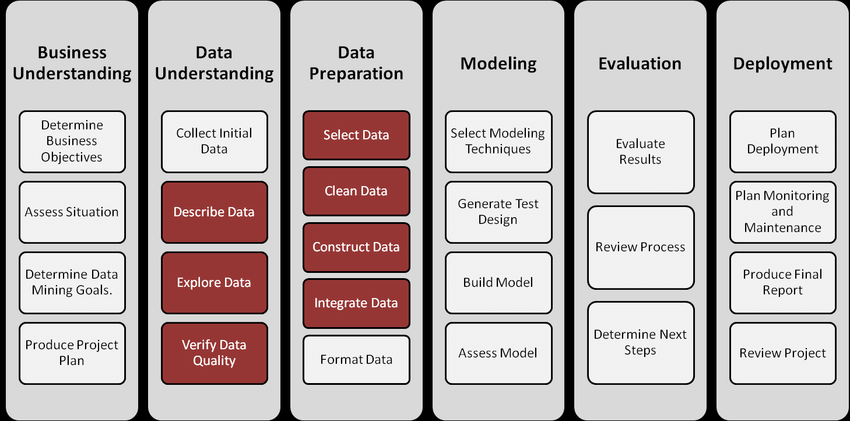

<br/>
<br/>

### Business Undertanding
- [CRISP-DM on AWS](https://gist.github.com/bluekidds/cad5c0ea2e5051b638ec39810f3c4b09)
- [The business understanding stage of the Team Data Science Process lifecycle](https://docs.microsoft.com/pt-br/azure/machine-learning/team-data-science-process/lifecycle-business-understanding)


<br/>

---

## Data Understanding

### Collect Initial Data
Most companies have an enormous amount of data, so it is essential to decide what types of data are needed for the project. Next, you need to determine where they are stored and how to gain access to the data. Depending on where your company stores the data, it’s up to data engineers to get the data from the company’s data source, clear the data and hand it over to the data scientist.

#### Code: Load and Save Dataset
- Load
```python
%%time

df = pd.read_csv('data/raw/deals.tsv',
                  sep='\t',
                  encoding='utf-8')

# CPU times: user 8.44 ms, sys: 14 µs, total: 8.45 ms
```

- Save
```python
%%time

def save_data(df: 'dataframe' = None,
              path: str = 'data/cleansing/') -> None:
    df.to_csv(path_or_buf = path,
              sep = ',',
              index = False,
              encoding = 'utf8')
    
    return "Saved!"

# CPU times: user 8.44 ms, sys: 14 µs, total: 8.45 ms
```


### Describe Data
First, you'll want to answer a set of basic questions about the dataset:

- How many observations do I have?
- How many features?
- What are the data types of my features? Are they numeric? Categorical?
- Do I have a target variable?

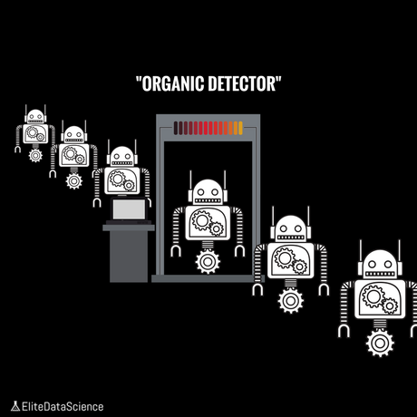

<br/>

#### Code
```python
df.head()
```

```python
print("Dataframe:\n{} rows\n{} columns".format(df.shape[0], df.shape[1]))

# Dataframe:
# 45222 rows
# 14 columns
```

```python
df.info()

# <class 'pandas.core.frame.DataFrame'>
# RangeIndex: 595212 entries, 0 to 595211
# Data columns (total 59 columns):
# id                595212 non-null int64
# target            595212 non-null int64
# ps_ind_01         595212 non-null int64
# ps_ind_02_cat     594996 non-null float64
# ...
```

#### Ways to Explore Data
- Summary Statistics
- Visualization

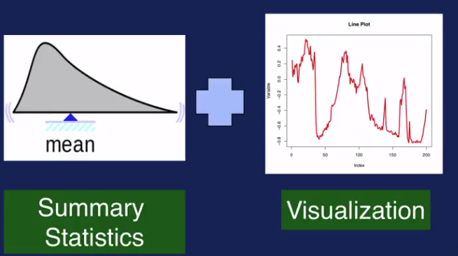

<br/>

### Irrelevant Data
Irrelevant observations are those that **don’t actually fit the specific problem** that you’re trying to solve.
<br/>
The first step to data cleaning is removing unwanted observations from your dataset.
<br/>
tip: in SQL every use `select distict`


<br/>

#### Code
```python
# unique()

def show_categorical_values(df: 'DataFrame', *columns: list) -> None:
    for column in columns:
        list_unique = df[column].unique()
        print(f"The categorical column {column} contains this values:\n\n{list_unique}")
```

<br/>

### Split Features
- Numerical cols
- Categorical cols
- All cols

```python
# Lists that will be manipulated in the data processing
list_columns = []
list_categorical_col = []
list_numerical_col = []


def get_col(df: 'dataframe', type_descr: 'numpy') -> list:
    """
    Function get list columns 
    
    Args:
    type_descr
        np.number, np.object -> return list with all columns
        np.number            -> return list numerical columns 
        np.object            -> return list object columns
    """
    try:
        col = (df.describe(include=type_descr).columns)  # pandas.core.indexes.base.Index  
    except ValueError:
        print(f'Dataframe not contains {type_descr} columns !', end='\n')    
    else:
        return col.tolist() 


list_numerical_col = get_col(df=df_callcenter,
                             type_descr=np.number)
list_categorical_col = get_col(df=df_callcenter,
                               type_descr=np.object)
list_columns = get_col(df=df_callcenter,
                       type_descr=[np.object, np.number])
```

<br/>

### Exploratory Analysis: Statistic
"_Get to know the dataset_"

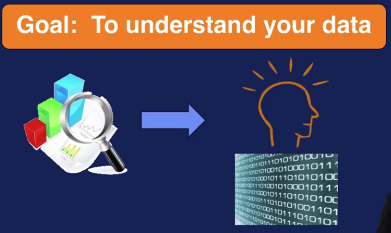

<br/>
<br/>

### Measures Central Trend 

- Mean: 
    - Necessay to get **standard deviation and variance**
    - More precise when distribuition follow Skewness
    
  - Meadian: 
    - Know center
    - More precise when distribuition not Skewness
    
  - Mode: 
    - Know trend
    
  - Skewness
    - Simetric distribution

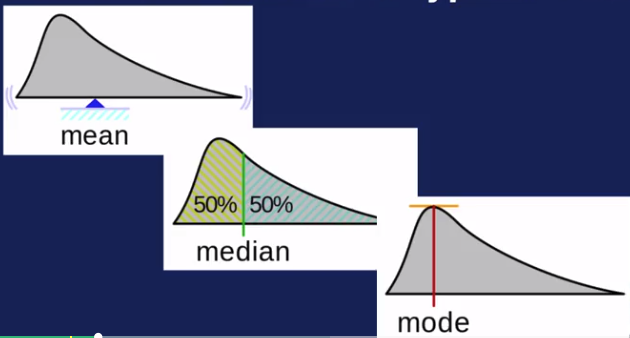

## Understand Data
- First read metadata
- View firsts lines
- View Shape
- Information About Column
  - column's name
  - row by column
  - type by column
  - type dataframe
  - size dataframe

```python
list_columns = (df_callcenter.columns).tolist()

print("-"*25, "List Columns", "-"*25, end='\n')
display(list_columns)
```


#### Measures Location
```python
def show_measures_location(df: 'dataframe', type_descr: 'list') -> 'dataframe':
    """
    Function get measures localization + total col + % type 
    Handler when type data not exists
    
    Args:
    type_descr
        np.number, np.object  -> return summary statistic with all columns
        np.number             -> return summary statistic numerical columns 
        np.object             -> return summary statistic object columns
    """
    try:
        col = (df.describe(include=type_descr).columns)  # pandas.core.indexes.base.Index  
    except ValueError:
        print(f'Dataframe not contains {type_descr} columns !', end='\n\n')    
    else:
        list_col = col.tolist()
        percentage = (len(list_col) / df.shape[1]) * 100
        
        print("-"*25, "MEASURES OF LOCALIZATION", "-"*25, end='\n\n')
        print(f"TOTAL columns {type_descr}: {len(list_col)}")
        print("PERCENTAGE {} in dataframe: {:3.4} %".format(type_descr, percentage))
        
        return df.describe(include=type_descr)


show_measures_location(df=df,
                       type_descr=[np.number, np.object])
show_measures_location(df=df,
                       type_descr=[np.number])]
show_measures_location(df=df,
                       type_descr=[np.object])
```

#### Measure of Shape
Medidas de forma descrevem a forma da distribuição de um conjunto de valores. 
- Skew
- kurtosis

#### Skewness
"Assimetria dos dados."

Quanto mais próximo estiver de 0, melhor (normal distribuition). A assimetria basicamente significa que os dados de saída estão concentrados em uma extremidade do intervalo. Nós gostamos que nossos dados sejam o mais central possível.

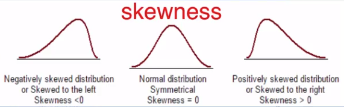

```python
df.skew()

# PassengerId    0.00
# Survived       0.48
# Pclass        -0.63
# Age            0.39
# SibSp          3.70
# Parch          2.75
# Fare           4.79
# dtype: float64
```

#### Kurtosis
kurtosis to measure how heavy its tails are compared to a normal distribution

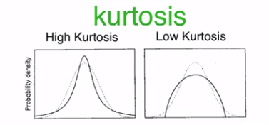

```python
from scipy.stats import kurtosis
from scipy.stats import skew


data = np.random.normal(0, 1, 10000000)
np.var(data)


print("Measure of Shape\n")
print("skew = ",skew(data))
print("kurt = ",kurtosis(data))

# Measure of Shape

# skew =  -0.0008084727188267447
# kurt =  0.00018034838623570693
```

```
#  At this point I decided to use dataframe to maintain the same function pattern df.describe()
# However, dictionnaires are more recommended because they are faster in a few data.

def show_measures_shape(df: 'dataframe', *columns: 'list') -> 'dataframe':
    index = ['skew', 'kurtosis'] 
    df_temp = pd.DataFrame(index=[index])
        
    print("-"*25, "MEASURES OF SHAPE", "-"*25, end='\n')
    
    for column in columns:
        list_temp = []
                
        list_temp.append(df[column].skew())
        list_temp.append(df[column].kurt())
        
        df_temp[column] = list_temp
    
    return df_temp

show_measures_shape(df_callcenter, *list_numerical_col)
```

#### Measures of spread 
- Standard Deviation
- Variance and Covariance 
  - Quanto, em média, as observações variam do valor médio.
- Maximum
- Minimum
- Range
- maximum - minimum

```python
def show_measures_spread(df: 'dataframe', *columns: 'list') -> 'dataframe':
    index = ['std_deviation_pop',
            'std_deviation',
             'variance_pop',
             'variance',
             'maximum',
             'minimum'] 

    df_temp = pd.DataFrame(index=[index])
    
    print("-"*25, "MEASURES OF SPREAD", "-"*25, end='\n\n')
    
    for column in columns:
        list_temp = []
                
        list_temp.append(statistics.pstdev(df[column])) # population
        list_temp.append(statistics.stdev(df[column])) # sample
        list_temp.append(statistics.pvariance(df[column])) # population
        list_temp.append(statistics.variance(df[column])) # sample
        list_temp.append(df[column].max())
        list_temp.append(df[column].min())
        
        df_temp[column] = list_temp
    
    return df_temp
```

```python
show_measures_spread(df_callcenter, *list_numerical_col)
```


#### Covariance
Measures the relationship between 2 or more variables

How interpreter?
<br/>
- The covariance signal can be interpreted as if the two variables **change in the same direction (positive) or change in different directions (negative).**
- The magnitude of the covariance is not easily interpreted.
- A covariance value of zero indicates that both variables are completely independent.


```python
# calculate the covariance between two variables
from numpy.random import randn
from numpy.random import seed
from numpy import cov
# seed random number generator
seed(1)
# prepare data
data1 = 20 * randn(1000) + 100
data2 = data1 + (10 * randn(1000) + 50)


# calculate covariance matrix
covariance = cov(data1, data2)
print(covariance)

# [[385.33297729 389.7545618 ]
#  [389.7545618  500.38006058]]
```
The covariance between the two variables is 389.75. We can see that this is positive, suggesting that the variables change in the same direction as we expect.


### Measure of Dependence
"Describe relationship between variables."

- Correlation is a value between -1 and 1
- Correlations near -1 or 1 indicate a strong relationship.
- Um valor abaixo de -0,5 ou acima de 0,5 indica uma correlação notável
- Aqueles mais próximos de 0 indicate a weak relationship.

#### Goal get with anasylis correlations

- Which features are strongly correlated with the **target variable**?
- Are there interesting or unexpected strong correlations between other features?


Types:
- Correlation Pearson
- Correlation Spearman


```python
df.corr()
```

#### Pearson
Tests whether two samples have a **linear relationship.**

```python
from numpy.random import seed
from numpy.random import randn
from scipy.stats import pearsonr

# seed random number generator
seed(1)
# prepare data
data1 = 20 * randn(1000) + 100
data2 = data1 + (10 * randn(1000) + 50)
# calculate Pearson's correlation
corr, p = pearsonr(data1, data2)
# display the correlation
print('Pearsons correlation: %.3f' % corr)
```

#### Spearman
Tests whether two samples have a **monotonic relationship.**
- Assumptions (Suposições)
   - The observations in each sample are independent and identically distributed (iid).
   - The observations in each sample can be classified.

```python
from scipy.stats import spearmanr
corr, p = spearmanr(data1, data2)
print('Spearman correlation: %.3f' % corr)
```

## Sample Size
- Too large samples are a waste of time and money, too small are inaccurate.
- The sample size is important in 2 points, first to determine if there is a minimum quantity to be analyzed and second, if it is possible to divide the sample into tranning and test data.

#### Steps to calculate
- Define the target feature
- Scale the data:
     - nominal
     - ordinal
     - interval
- Calculate population size
- Calculate the standard deviation
- Calculate the sampling error
- Determine the confidence interval
- Find the Z score

`sample_size = (z * std) / error`


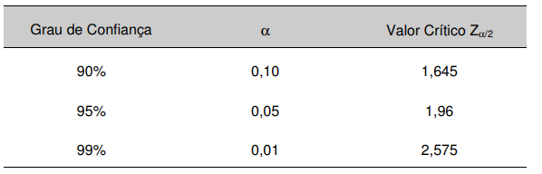


### Bessel Correction
When taking a sample from a population most values tend to be in the middle of the population, especially if the distribution is normal.

Bessel correction is used to increase standard deviation and data variance


### Statistical Hypothesis Tests
The data must be interpreted to add meaning. We can interpret data by assuming a specific structure in our result and use statistical methods to confirm or reject the assumption.

- Hypothesis 0 (H0): The assumption of the test is valid and has not been rejected.
- Hypothesis 1 (H1): The assumption of the test is not valid and is rejected at some level of significance.


A widely used statistical hypothesis test is the Student's t test to compare the mean values of two independent samples.

The test works by checking the means of two samples to see if they are significantly different from each other

At the end of the exploration **create the hypotheses and think about what to analyze**.

Keep in mind, however, that better data often outperforms better algorithms, and designing good resources is a big step forward. And if you have a huge data set, any sorting algorithm used may not matter much in terms of sorting performance (choose your algorithm based on speed or ease of use).

<br/>

---

## Data Preparation


<br/>
<br/>

### Name Adaption of Features
- strip() in features names
- Name dont must capitalize
- lower case
- without spaces

#### Strip and Lower
```python
print(df.columns)
# [' contactsId', 'contactsName   ', 'contactsDateCreated','CONTACTSCreatedBy']
```

```python
formated_columns = [col.strip().lower() for col in contacts.columns]
df.columns = formated_columns

print(df.columns)
# ['contactsid', 'contactsname', 'contactsdatecreated', 'contactscreatedby']
```

### Set Index
```python
display(df)
#   month	year	sale
# 0	   1	2012	55
# 1	   4	2014	40
# 2	   7	2013	84
# 3    10	2014	31
```

```python
df.set_index('month')
# 	    year	sale
# month		
# 1	    2012	55
# 4	    2014	40
# 7	    2013	84
# 10	2014	31
```

```python
df.set_index(['year', 'month'])
# 	          sale
# year	month	
# 2012	   1	55
# 2014	   4	40
# 2013	   7	84
# 2014	   10	31
```

```python
df.set_index([pd.Index([1, 2, 3, 4]), 'year'])
# 	       month	sale
#   year		
# 1	2012	   1	55
# 2	2014	   4	40
# 3	2013	   7	84
# 4	2014	   10	31
```

<br/>

### One-hot-encoding
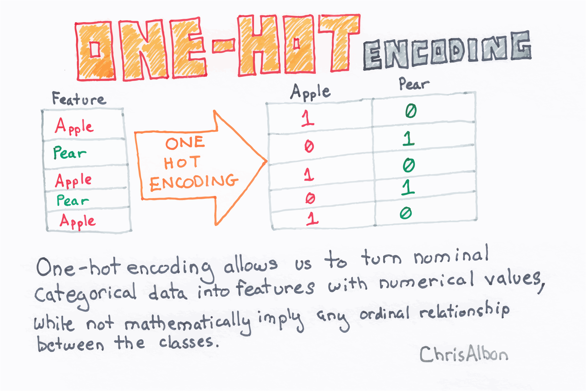

<br/>

#### Example 01
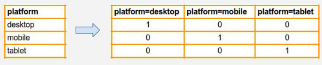

<br/>

#### Example 02
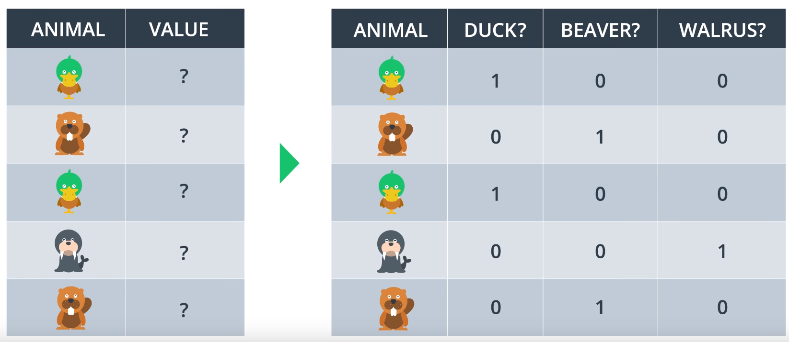

<br/>
<br/>

### Map Columns Values
```python
# I used the dictionary because they are more efficient in these cases
# https://stackoverflow.com/questions/22084338/pandas-dataframe-performance

def generate_dict_by_col(df: 'dataframe', *columns: list) -> dict:
    """
    :return:
        Return a dict with label of each column 
    """
    dict_unique = {}
    
    for column in columns:
        list_unique = df[column].unique().tolist()
        dict_column = {}
    
        for element in list_unique:
            if isinstance(element, float) is True:  # type nan is float
                continue
            dict_column[element] = int(list_unique.index(element))
        # add dict column in principal dict 
        dict_unique[column] = dict_column          
    
    print("-"*25, "Dictionary with Values Map by Column", "-"*25, end='\n\n')
    return dict_unique
```

```python
dict_cat_unique = generate_number_by_col(df_callcenter, 
                                         *list_categorical_col)

pp.pprint(dict_cat_unique)
# -------------- Dictionary with Values Map by Column ------------

# {   'campanha_anterior': {'fracasso': 1, 'nao_existente': 0, 'sucesso': 2},
#     'dia_da_semana': {'qua': 2, 'qui': 3, 'seg': 0, 'sex': 4, 'ter': 1},
#     'educacao': {   'analfabeto': 7,
#                     'curso_tecnico': 4,
#                     'ensino_medio': 1,
#                     'fundamental_4a': 0,
#                     'fundamental_6a': 2,
#                     'fundamental_9a': 3,
#                     'graduacao_completa': 6},
#     'emprestimo_moradia': {'nao': 0, 'sim': 1},
#     'emprestimo_pessoal': {'nao': 0, 'sim': 1},
#     'estado_civil': {'casado': 0, 'divorciado': 2, 'solteiro': 1},
#     'inadimplente': {'nao': 0, 'sim': 2},
#     'meio_contato': {'celular': 1, 'telefone': 0},
#     'mes': {   'abr': 8,
#                'ago': 3,
#                'dez': 6,
#                'jul': 2,
#                'jun': 1,
#                'mai': 0,
#                'mar': 7,
#                'nov': 5,
#                'out': 4,
#                'set': 9},
#     'profissao': {   'admin.': 2,
#                      'aposentado': 5,
#                      'colarinho_azul': 3,
#                      'desempregado': 7,
#                      'dona_casa': 0,
#                      'empreendedor': 10,
#                      'estudante': 11,
#                      'gerente': 6,
#                      'informal': 8,
#                      'servicos': 1,
#                      'tecnico': 4},
#     'resultado': {'nao': 0, 'sim': 1}}
```

---

### Duplicate Records
Can receive when:
- Combine datasets from multiple places
- Scrape data
- Receive data from clients/other departments

**NOTE:** Always analyze if the repeated values are not super coincidences.
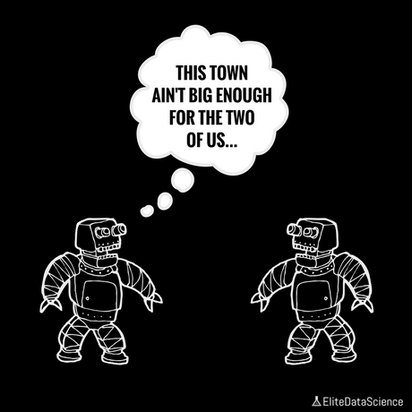

<br/>

```python
# duplicated()

def check_quat_duplicated_data(df: 'DataFrame') -> None:
    """
    Check if contains duplicated data
    Mark duplicates as ``True`` if enough row equal
    Except for the first occurrence.    
    """
    duplicated = df.duplicated().sum()
    total_lines = df.shape[0]
    percentage = (duplicated/total_lines) * 100
    
    print("-"*25, "DUPLICATED DATA", "-"*25,)
    print("\nSHAPE of data: {}".format(df.shape[0]))
    print("TOTAL duplicated data: {}".format(duplicated))
    print("PERCENTAGE duplicated data: {} %".format(percentage)) 
```

```python
check_quat_duplicated_data(df_callcenter)

# ------------------------- DUPLICATED DATA -------------------------

# SHAPE of data: 41188
# TOTAL duplicated data: 0
# PERCENTAGE duplicated data: 0.0 %
```

<br/>

#### % Duplicated Values
```python
# % duplicated values

duplicated = dataframe.duplicated().sum()
total_cells = np.product(dataframe.shape)

print("In dataset dataframe has {}% of duplicated values.".format((duplicated/total_cells) * 100))
```

<br/>

#### Create dataframe only duplicated values
```python
dataframe[dataframe.duplicated(keep=False)]
```

#### Create Tag Duplicated Values
```python
def calcule_duplicated_values(df_in):
    """
    Return dataframe with columns contains duplicated values
    """
    # Total
    duplicated = dataframe.duplicated().sum()
    print('Total of duplicated values: {}' .format(duplicated))

    # Create column 
    df_duplicated = df_in[df_in.duplicated(keep=False)]
    df_in['duplicated_values'] = None    # first create empty column 
    
    # Insert new column in df
    df_in['duplicated_values'] = df_duplicated
    
    # Replace None by 0
    df_in['duplicated_values'] = df_in['duplicated_values'].replace(np.nan, 0, regex=True)    

calcule_duplicated_values(dataframe)
```

<br/>

---

### Missing Values
**You cannot simply ignore missing values in your dataset.** You must handle them in some way.

**ASK:** Is a missing data because it was not recorded or because it does not exist?
<br/>
To answer this question, it is necessary to analyze the fields without data.


#### Check Values Missing
```python
# return TRUE if collumn contains values missing

missing = dataframe.isnull().any()
print(missing)

# account_key          False
# status               False
# join_date            False
# cancel_date           True
# days_to_cancel        True
# is_udacity           False
# is_canceled          False
# duplicated_values    False
# dtype: bool
```

```python
dataframe.isnull().sum()

# account_key            0
# status                 0
# join_date              0
# cancel_date          652
# days_to_cancel       652
# is_udacity             0
# is_canceled            0
# duplicated_values      0
# missing_values         0
# dtype: int64
```

```python
# isnull()

def check_columns_missing_val(df: 'DataFrame'):
    """
    Return TRUE, if collumn contains values missing
    """
    list_columns_missing = []
    
    for index, value in enumerate(df.isnull().any()):
        if value is True:
            list_columns_missing.append(df.columns[index])
    
    if len(list_columns_missing) > 0:
        print("Columns's name with missing values:")
        return list_columns_missing   
    
    return "The dataframe NOT contains missing values."
```
```python
# df.isnull().sum().sum()

def check_quat_missing_data(df: 'DataFrame', columns_m_v: list) -> None:
    """
    Check if contains missing data
    Mark missing, if line contains NaN in any column
    """    
    missing_values_count = df.isnull().sum()
    total_missing = missing_values_count.sum()
    total_lines = df.shape[0]
    total_cells = np.product(df.shape)
        
    percentage_by_line = (total_missing/total_lines) * 100
    percentage_by_cell = (total_missing/total_cells) * 100
    
    # by column
    quant_missing_by_column = df[columns_m_v].isnull().sum()
    percentage_missing_by_column = (quant_missing_by_column/total_lines) * 100
    
    print("-"*25, "MISSING VALUES", "-"*25)
    print("\nSHAPE of data: {}".format(df.shape[0]))
    print("TOTAL missing values: {}".format(total_missing))
    print("TOTAL missing values by column:\n{}\n".format(quant_missing_by_column))
    
    print("PERCENTAGE missing values by cell: {:2.3} %".format(percentage_by_cell))
    print("PERCENTAGE missing values by row: {:2.3} %".format(percentage_by_line))
    print("PERCENTAGE missing values by column:\n{}".format(percentage_missing_by_column)) 

# ------------------------- MISSING VALUES -------------------------

# SHAPE of data: 41188
# TOTAL missing values: 95094
# TOTAL missing values by column:
# profissao               330
# estado_civil             80
# educacao               1731
# inadimplente           8597
# emprestimo_moradia      990
# emprestimo_pessoal      990
# mes                   41188
# dia_da_semana         41188
# dtype: int64

# PERCENTAGE missing values by cell: 11.0 %
# PERCENTAGE missing values by row: 2.31e+02 %
# PERCENTAGE missing values by column:
# profissao              1
# estado_civil           0
# educacao               4
# inadimplente          21
# emprestimo_moradia     2
# emprestimo_pessoal     2
# mes                  100
# dia_da_semana        100
# dtype: float64
```

#### Create Tag Missing Values
```python
def calcule_missing_values(df_in):
    """
    Return dataframe with columns contains missing values
    """
    # Total
    total_missing_values = df_in.isnull().sum().sum()
    print('Total of missing values: {}' .format(total_missing_values))
    
    # Columns
    missing_value_columns = df_in.columns[dataframe.isnull().any()].tolist()
    print('Columns with missing values: {}' .format(missing_value_columns))

    # Create column 
    df_null = df_in[df_in.isnull().any(axis=1)]
    df_in['missing_values'] = None    # first create empty column 
    
    # Insert new column in df
    df_in['missing_values'] = df_null
    
    # Replace None by 0
    df_in['missing_values'] = df_in['missing_values'].replace(np.nan, 0, regex=True)
    
    # Convert values in integer
    df_in['missing_values'] = df_in['missing_values'].astype(str)
    

calcule_missing_values(dataframe)

# Total of missing values: 1304
# Columns with missing values: ['cancel_date', 'days_to_cancel']
```

_Before observation missing values is necessary take decision if **remove** or **keep** missing values._


#### Handler Missing Values
1. Dropping
2. Replacing by value out of distribuition
3. Apply mean or mode
4. Reconstruct values
5. Label

### Missing categorical data
- Apply **mode**
- Label values as `missing`
- Subistituir por algum valor fora do intervalo de distribuition

### Missing numeric data
- Apply **mean**
- The easy way `value = 0`.

### Note
- xgBoost working with missing values


### Dropping `dropna()`
- Remove rows : `dataframe.dropna()`
- Remove colluns: `dataframe.dropna(axis=1)`

#### Note
axis=0 : row
<br/>
axis=1 : column

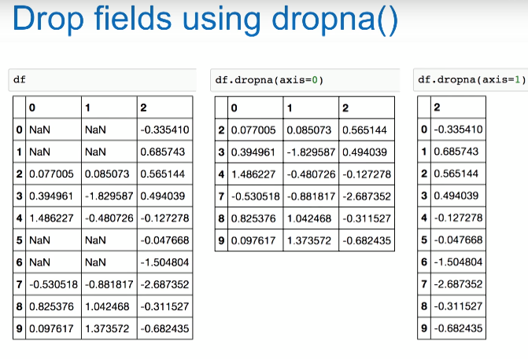

<br/>

### Replacing by value out of distribuition `fillna()`

 - Eg: `-999`, `-1`, ...
 - **BAD**:  neural networks.

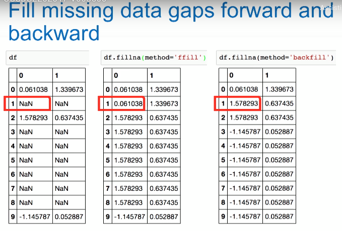

<br/>

### Apply mean or mode `fillna()`
 - **GOOD**: linear models and neural networks.
 - **BAD**:  para as tree, pode ser mais difícil selecionar o objeto que tinha missing values, logo de início.

<br/>

#### Reconstruct values
Replace using an algorithm. the forecasting model is one of the sophisticated methods for dealing with missing data. Here, we create a predictive model to estimate values that will replace missing data. In this case, we divided our data set into two sets: one set with no missing values for the variable and one with missing values. The first data set becomes the model's training data set, while the second data set with missing values is the test data set and the variable with missing values is treated as the target variable.
   - KNN using the neighbors.
   - Logistic regression

<br/>

### Label `fillna() `
 - **GOOD**: trees and neural networks
 - **BAD**: increase columns numbers.

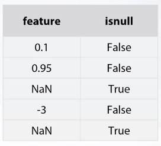

<br/>
<br/>

#### Linear Interpolation
 - Times series

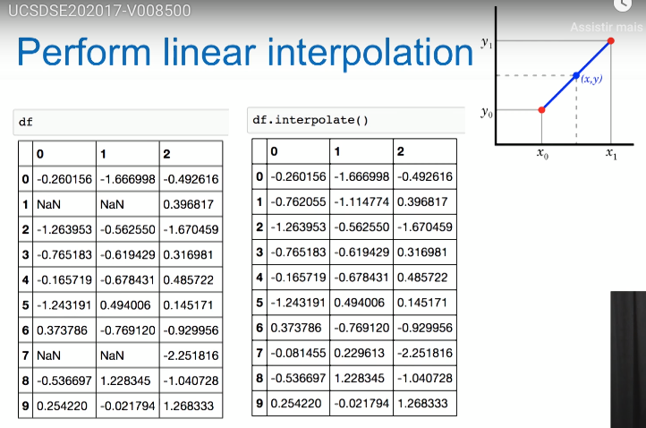

<br/>
<br/>

### Fixing Data Types
- data conversion 
- It is recommended to treat missing values first

```python
deals['dealsDateCreated'] = pd.to_datetime(deals['dealsDateCreated'], 
                                           yearfirst=False)

#Transform string to date
data['date'] = pd.to_datetime(data.date, format="%d-%m-%Y")

#Extracting Year
data['year'] = data['date'].dt.year

#Extracting Month
data['month'] = data['date'].dt.month

#Extracting the weekday name of the date
data['day_name'] = data['date'].dt.day_name()
```

```python
pd.to_numeric(deals['dealsPrice'], 
              errors='ignore', 
              downcast='integer')

deals['dealsPrice'].astype(dtype='int32', 
                           errors='ignore')

deals['dealsId'].astype(str)                        
```

```python
def handler_typing(df: 'dataframe', type_col: str, list_cont_feature: list, *columns: list):
    for column in columns:
        if column in list_cont_feature:
            print(column)
            df[column] = df[column].map('{:,.2f}'.format) \
                        .astype(float) # object -> float
            continue
            
        df[column] = df[column].astype(dtype=type_col, errors='raise')
    
    return df.info(), display(df.head())
```
```python
list_cont_feature = ['indice_precos_consumidor',
                     'indice_confianca_consumidor',
                     'euribor3m']

handler_typing(df_callcenter, 'int16', list_cont_feature, *list_columns)
```
<br/>

---


### Outliers
```
Better Data > Fancier Algorithms
```
- Check if contains outliers
- Count outliers
- Check percentage
- Plot outliers
- Handler outliers
  - drop
  - mark
  - rescale
- In general, if you have a **legitimate** reason to remove an outlier, it will help your model’s performance.
- However, outliers are innocent until proven guilty. **You should never remove an outlier just because it’s a "big number." **

```python
# quantile()

dict_quantile = {}

def calculate_quantile_by_col(df: 'dataframe', *columns: list) -> None:
    """
    Calculate boxplot
    """
    for column in columns:
        dict_col = {}
       
        q1 = df[column].quantile(0.25)
        q3 = df[column].quantile(0.75)
        iqr = q3 - q1  # Interquartile range

        dict_col[column] = {'q1': q1,
                            'q3': q3,
                            'iqr': iqr}
        # add dict column in principal dict
        dict_quantile.update(dict_col)
```
```python
def calculate_fence(dict_col: 'dataframe', *columns: list) -> None:
    for column in columns:
        dict_actual_col = dict_col[column]  # mount internal dict of dict_quantile
        dict_fence = {}  # auxiliar dict
        
        fence_low  = dict_actual_col['q1'] - 1.5 * dict_actual_col['iqr']
        fence_high = dict_actual_col['q3'] + 1.5 * dict_actual_col['iqr']
        
        dict_fence = {'fence_low': fence_low,
                     'fence_high': fence_high}
        
        # add dict column in principal dict
        dict_col[column].update(dict_fence)
```
```python
def count_outlier(df: 'dataframe', dict_quantile: dict, *columns: list):
    for column in columns:
        # mount internal dict of dict_quantile
        dict_actual_col = dict_quantile[column]

        outlier_less_q1 = (df[column] < dict_actual_col['fence_low']).sum()  # numpy.int64
        outlier_more_q3 = (df[column] > dict_actual_col['fence_high']).sum()  # numpy.int64
        total = outlier_less_q1 + outlier_more_q3
        
        dict_outlier = {'outlier_less_q1': outlier_less_q1,
                        'outlier_more_q3': outlier_more_q3,
                        'outlier_total': total}
        
        # add dict column in principal dict
        dict_quantile[column].update(dict_outlier)
        
    print("-"*25, "Dict Quantilie", "-"*25, end='\n\n')
    return pp.pprint(dict_quantile)
```

```python
def check_percentage_outlier(df: 'dataframe', dict_quantile: dict, *columns: list):
    outlier_total = 0
    total_lines = df.shape[0]
    total_cells = np.product(df.shape)
    
    print("-"*15, "OUTLIERS", "-"*15)
    print("\nSHAPE of data: {}".format(df.shape[0]))
    print("\nPERCENTAGE outlier by column:") 
    
    # by column
    for column in columns:
        dict_actual_col = dict_quantile[column]  # mount internal dict of dict_quantile
        outlier_total += dict_actual_col['outlier_total']

        quant_outlier_by_col = dict_actual_col['outlier_total']
        percentage_outlier_by_col = (quant_outlier_by_col/total_lines) * 100
        
        print("{}: {:4.4} %".format(column, percentage_outlier_by_col)) 

        
    percentage_by_line = (outlier_total/total_lines) * 100
    percentage_by_cell = (outlier_total/total_cells) * 100
        
    print("PERCENTAGE outlier by line: {:2.3} %".format(percentage_by_line))
    print("PERCENTAGE outlier by cell: {:2.3} %".format(percentage_by_cell))
    print("\nTOTAL outlier: {}".format(outlier_total))
```

```python
# run
calculate_quantile_by_col(df_callcenter_cleasing, *list_columns)
calculate_fence(dict_quantile, *list_columns)
count_outlier(df_callcenter_cleasing, dict_quantile, *list_columns)

# ------------------------- Dict Quantilie -------------------------

# {   'campanha_anterior': {   'fence_high': 0.0,
#                              'fence_low': 0.0,
#                              'iqr': 0.0,
#                              'outlier_less_q1': 0,
#                              'outlier_more_q3': 5625,
#                              'outlier_total': 5625,
#                              'q1': 0.0,
#                              'q3': 0.0},
#     'dia_da_semana': {   'fence_high': 7.0,
#                          'fence_low': -1.0,
#                          'iqr': 2.0,
#                          'outlier_less_q1': 0,
#                          'outlier_more_q3': 0,
#                          'outlier_total': 0,
#                          'q1': 2.0,
#                          'q3': 4.0},
#     'dias_ultimo_contato': {   'fence_high': 0.0,
#                                'fence_low': 0.0,
#                                'iqr': 0.0,
#                                'outlier_less_q1': 0,
#                                'outlier_more_q3': 1500,
#                                'outlier_total': 1500,
#                                'q1': 0.0,
#                                'q3': 0.0},
#     'duracao': {   'fence_high': 6.5,
#                    'fence_low': 2.5,
#                    'iqr': 1.0,
#                    'outlier_less_q1': 1020,
#                    'outlier_more_q3': 714,
#                    'outlier_total': 1734,
#                    'q1': 4.0,
#                    'q3': 5.0},
#     'educacao': {   'fence_high': 11.0,
#                     'fence_low': -5.0,
#                     'iqr': 4.0,
#                     'outlier_less_q1': 0,
#                     'outlier_more_q3': 0,
#                     'outlier_total': 0,
#                     'q1': 1.0,
#                     'q3': 5.0},
#     'emprestimo_moradia': {   'fence_high': 2.5,
#                               'fence_low': -1.5,
#                               'iqr': 1.0,
#                               'outlier_less_q1': 0,
#                               'outlier_more_q3': 0,
#                               'outlier_total': 0,
#                               'q1': 0.0,
#                               'q3': 1.0},
#     'emprestimo_pessoal': {   'fence_high': 0.0,
#                               'fence_low': 0.0,
#                               'iqr': 0.0,
#                               'outlier_less_q1': 0,
#                               'outlier_more_q3': 6248,
#                               'outlier_total': 6248,
#                               'q1': 0.0,
#                               'q3': 0.0},
#     'estado_civil': {   'fence_high': 2.5,
#                         'fence_low': -1.5,
#                         'iqr': 1.0,
#                         'outlier_less_q1': 0,
#                         'outlier_more_q3': 0,
#                         'outlier_total': 0,
#                         'q1': 0.0,
#                         'q3': 1.0},
#     'euribor3m': {   'fence_high': 10.39,
#                      'fence_low': -4.09,
#                      'iqr': 3.62,
#                      'outlier_less_q1': 0,
#                      'outlier_more_q3': 0,
#                      'outlier_total': 0,
#                      'q1': 1.34,
#                      'q3': 4.96},
#     'idade': {   'fence_high': 69.5,
#                  'fence_low': 9.5,
#                  'iqr': 15.0,
#                  'outlier_less_q1': 0,
#                  'outlier_more_q3': 468,
#                  'outlier_total': 468,
#                  'q1': 32.0,
#                  'q3': 47.0},
#     'inadimplente': {   'fence_high': 0.0,
#                         'fence_low': 0.0,
#                         'iqr': 0.0,
#                         'outlier_less_q1': 0,
#                         'outlier_more_q3': 3,
#                         'outlier_total': 3,
#                         'q1': 0.0,
#                         'q3': 0.0},
#     'indice_confianca_consumidor': {   'fence_high': -26.949999999999992,
#                                        'fence_low': -52.150000000000006,
#                                        'iqr': 6.300000000000004,
#                                        'outlier_less_q1': 0,
#                                        'outlier_more_q3': 446,
#                                        'outlier_total': 446,
#                                        'q1': -42.7,
#                                        'q3': -36.4},
#     'indice_precos_consumidor': {   'fence_high': 95.35499999999999,
#                                     'fence_low': 91.715,
#                                     'iqr': 0.9099999999999966,
#                                     'outlier_less_q1': 0,
#                                     'outlier_more_q3': 0,
#                                     'outlier_total': 0,
#                                     'q1': 93.08,
#                                     'q3': 93.99},
#     'meio_contato': {   'fence_high': 2.5,
#                         'fence_low': -1.5,
#                         'iqr': 1.0,
#                         'outlier_less_q1': 0,
#                         'outlier_more_q3': 0,
#                         'outlier_total': 0,
#                         'q1': 0.0,
#                         'q3': 1.0},
#     'mes': {   'fence_high': 12.5,
#                'fence_low': 0.5,
#                'iqr': 3.0,
#                'outlier_less_q1': 0,
#                'outlier_more_q3': 0,
#                'outlier_total': 0,
#                'q1': 5.0,
#                'q3': 8.0},
#     'numero_empregados': {   'fence_high': 5421.5,
#                              'fence_low': 4905.5,
#                              'iqr': 129.0,
#                              'outlier_less_q1': 0,
#                              'outlier_more_q3': 0,
#                              'outlier_total': 0,
#                              'q1': 5099.0,
#                              'q3': 5228.0},
#     'profissao': {   'fence_high': 7.0,
#                      'fence_low': -1.0,
#                      'iqr': 2.0,
#                      'outlier_less_q1': 0,
#                      'outlier_more_q3': 3752,
#                      'outlier_total': 3752,
#                      'q1': 2.0,
#                      'q3': 4.0},
#     'qtd_contatos_campanha': {   'fence_high': 2.5,
#                                  'fence_low': -1.5,
#                                  'iqr': 1.0,
#                                  'outlier_less_q1': 0,
#                                  'outlier_more_q3': 157,
#                                  'outlier_total': 157,
#                                  'q1': 0.0,
#                                  'q3': 1.0},
#     'qtd_contatos_total': {   'fence_high': 0.0,
#                               'fence_low': 0.0,
#                               'iqr': 0.0,
#                               'outlier_less_q1': 0,
#                               'outlier_more_q3': 5625,
#                               'outlier_total': 5625,
#                               'q1': 0.0,
#                               'q3': 0.0},
#     'resultado': {   'fence_high': 0.0,
#                      'fence_low': 0.0,
#                      'iqr': 0.0,
#                      'outlier_less_q1': 0,
#                      'outlier_more_q3': 4639,
#                      'outlier_total': 4639,
#                      'q1': 0.0,
#                      'q3': 0.0}}
```

```python
check_percentage_outlier(df_callcenter_cleasing, dict_quantile, *list_columns)

# --------------- OUTLIERS ---------------

# SHAPE of data: 41170

# PERCENTAGE outlier by column:
# idade: 1.137 %
# profissao: 9.113 %
# estado_civil:  0.0 %
# educacao:  0.0 %
# inadimplente: 0.007287 %
# emprestimo_moradia:  0.0 %
# emprestimo_pessoal: 15.18 %
# meio_contato:  0.0 %
# mes:  0.0 %
# dia_da_semana:  0.0 %
# duracao: 4.212 %
# qtd_contatos_campanha: 0.3813 %
# dias_ultimo_contato: 3.643 %
# qtd_contatos_total: 13.66 %
# campanha_anterior: 13.66 %
# indice_precos_consumidor:  0.0 %
# indice_confianca_consumidor: 1.083 %
# euribor3m:  0.0 %
# numero_empregados:  0.0 %
# resultado: 11.27 %
# PERCENTAGE outlier by line: 73.3 %
# PERCENTAGE outlier by cell: 3.67 %

# TOTAL outlier: 30197
```

#### Plot Outliers
Undertanding box-plot

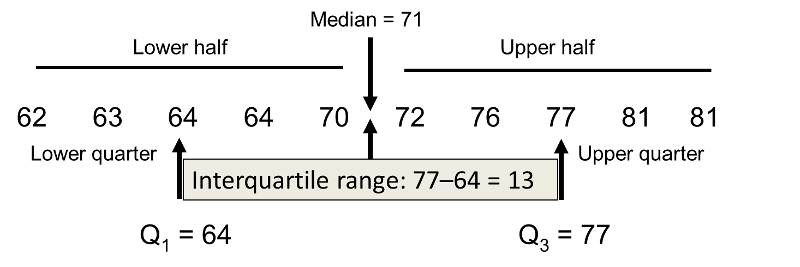

<br/>

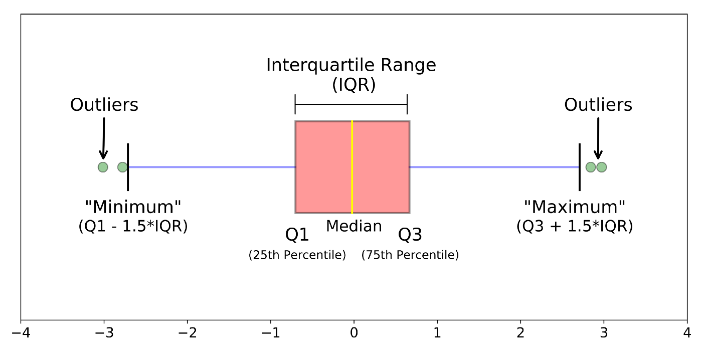

<br/>

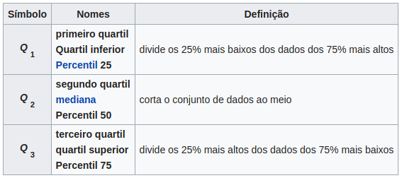

```python
import seaborn as sns
sns.boxplot(x=df_callcenter['duracao'],
            width=0.5)
```

```python
def plot_box_plot(df: 'dataframe', data_set_name: str, xlim=None):
    """
    Creates a seaborn boxplot including all dependent
    
    Args:
    data_set_name: Name of title for the boxplot
    xlim: Set upper and lower x-limits
    
    Returns:
    Box plot with specified data_frame, title, and x-limits 
    """
    fig, ax = plt.subplots(figsize=(18, 10))

    if xlim is not None:
        plt.xlim(*xlim)
    
    plt.title(f"Horizontal Boxplot {data_set_name}")
        
    plt.ylabel('Dependent Variables')
    plt.xlabel('Measurement x')
    ax = sns.boxplot(data = df,
                    orient = 'h', 
                    palette = 'Set2',
                    notch = False, # box instead of notch shape 
                    sym = 'rs')  # red squares for outliers

    plt.show()
```

```python
plot_box_plot(df_callcenter_cleasing, 
              'Box Plot', 
              (-60, 60))
```
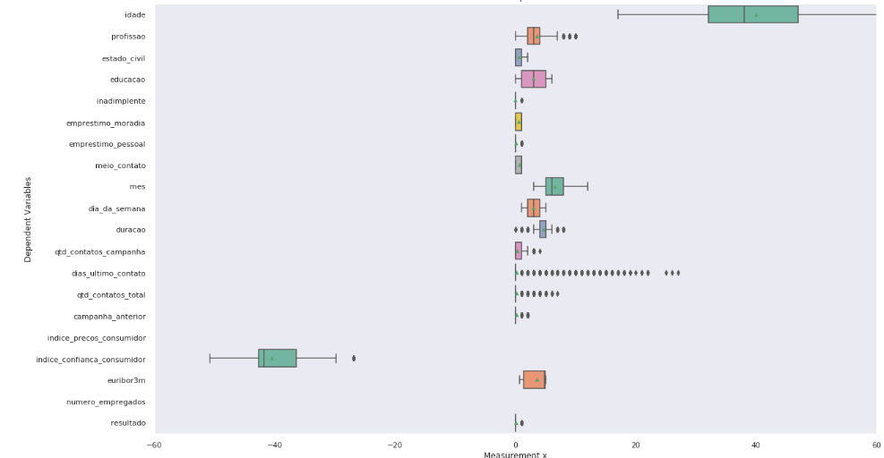

<br/>

```python
def show_boxplot(df, *columns):
    for column in columns:
        plt.figure (figsize = (17, 1)) 
        sns.boxplot(x=df[column],
                    width=0.3,
                    linewidth=1.0,
                    showfliers=True)

show_boxplot(df_callcenter_cleasing, *list_columns)
```

#### Boxplot on a Normal Distribution
The graph Normal ditribuition help understand a boxplot.

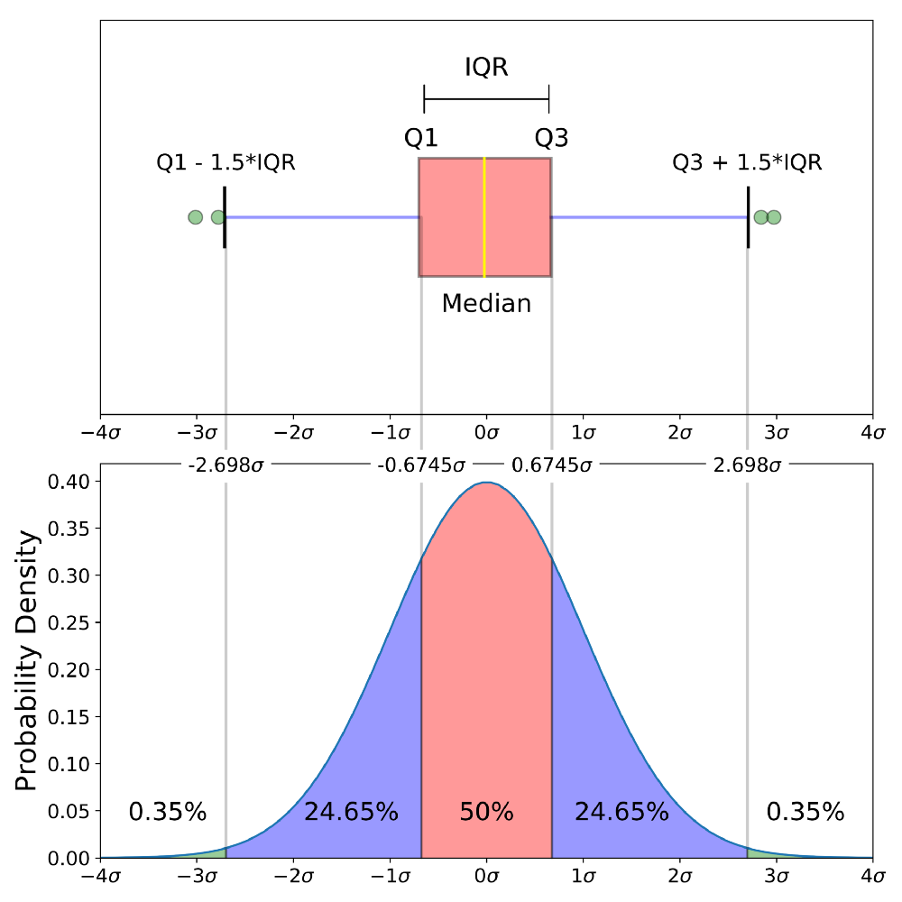

<br/>
<br/>

#### Remove Outliers
- Drop
- Mark
- Median
- Rescale 

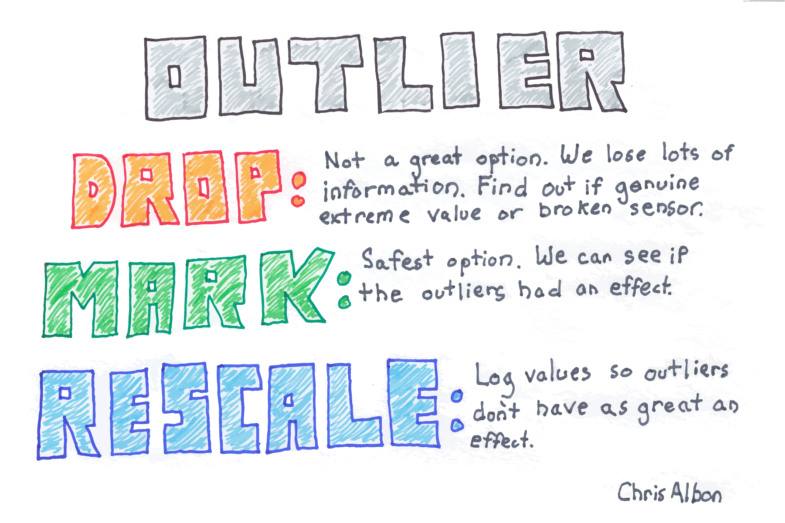

### Drop

1. Select conditional
  - `query()` process using `loc[]` and `eval()` 
  - `loc()`

2. Drop row
  - `drop(axis=1)`


#### Select conditional
```python
# query()
# &, |, in, !

df_result_query = df_callcenter.query('duracao == 0 & idade > 50',
                                       inplace=False)

# loc()
cond = df_callcenter['duracao'] == 0
cond2 = df_callcenter['idade'] > 50

df_result_loc = df_callcenter.loc[cond & cond2]
```

#### Drop Row
```python
df_callcenter = df_callcenter.drop(df_result_query, axis=1)
```

<br/>

#### Mark
Create feature `['outliers']` where:
- 0 is not outlier
- 1 is outlier

```python
# where()

# Create feature based on boolean condition
cond = df_callcenter['duracao'] < 600

# Create feature 
df_callcenter['outlier'] = np.where(cond, 0, 1)

# Show data
df_callcenter.head()
```

<br/>

---

### Feature Engineering
_“Coming up with features is difficult, time-consuming, requires expert knowledge. ‘Applied machine learning’ is basically feature engineering.”_

Feature engineering is about creating new input features from your existing ones.

- Feature Enginnering = **ADD features**
- Data Cleaning = **REMOVE features**

This is often one of the most valuable tasks a data scientist can do to improve model performance

You can isolate and highlight important information, which helps your algorithms to "focus" on what's important.
You can bring your own domain knowledge. Create new features from what you already know, for example, on facebook stock price, that day the cambriege analysis scandal happened

It is the part where most hypotheses are tested!

- Structured Data
  - Numerical (continuos and discret)
  - Categorical
  - Temporal Series
- Unstrucutred Data
  - Images
  - Text
- Feature Selection
  - Filtering
    - Correlations
  - Reduce Dimensionality
  - Feature Importance


#### List of Techniques
Numerical Features

1. Log Transform

log_function.png
log_example.png

1. Binarization
    1. One-Hot Encoding (3-preprocessing)


1. Feature scaling
 - MinMax Scaling
 - Standard Scaling (Z-score)
 
1. Normalization

1. Binning (continuos ---> discretize)
  - data wawrehouse
  - Cada bin representa um range de dados
  - The main motivation of binning is to make the model more robust and prevent overfitting, however, it has a cost to the performance
   - Every time you bin something, you sacrifice information and make your data more regularized. 
  - The trade-off between performance and overfitting is the key point of the binning process.


1. Grouping Operations
  - Categorical Column Grouping
    - highest frequency. `groupby()`
    - pivot table `pivot_table()` pivot_table.png aggregated functions for the values between grouped and encoded columns. This would be a good option if you aim to go beyond binary flag columns and merge multiple features into aggregated features
  - Numerical Column Grouping: Numerical columns are grouped using sum and mean functions in most of the cases.


1. Feature Hashing
For large scale categorical features
- Hashing schemes work on strings, numbers and other structures like vectors. 
- `FeatureHasher()`


This is often one of the most valuable tasks a data scientist can do to improve model performance

Você pode isolar e destacar informações importantes, o que ajuda seus algoritmos a "se concentrar" no que é importante.
Você pode trazer seu próprio conhecimento de domínio. Crie novas features a partir do que vc já sabe, por exemplo, em stock price do facebook, tal dia aconteceu o escandalo do cambriege analystics

- one-hot encoding
- Bag of words
- Dummy variables
- Feature Selection
- Feature Importance
- Interaction Features (products, sums, or differences between two features.)

<br/>


#### Binarization

Transform features into binary features.

Tescniques:

- **Binarization:** continuos and discret features
- **One Hot Enconding:** categorical features


### `Binarizer()`
Gross frequencies or counts ** may not be relevant ** for building a model based on the problem being solved.

For example, if I am creating a recommendation system for song recommendations, I would just like to know if a person is interested or has already heard a particular song. This does not require the number of times a song has been heard, as I am more concerned with the various songs he has listened to.

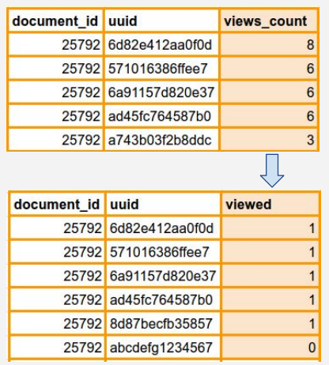


```python
popsong_df = pd.read_csv('data/raw/song_views.csv', encoding='utf-8')
popsong_df.head(9)

# 	user_id	    song_id	            title	       listen_count
# 0	b6b799f3	SOBONKR12A58A7A7E0	You're The One	2
# 1	b41ead73	SOBONKR12A58A7A7E0	You're The One	0
# 2	4c84359a	SOBONKR12A58A7A7E0	You're The One	0
# 3	779b5908	SOBONKR12A58A7A7E0	You're The One	0
# 4	dd88ea94	SOBONKR12A58A7A7E0	You're The One	0
# 5	68f0359a	SOBONKR12A58A7A7E0	You're The One	0
# 6	116a4c95    SOBONKR12A58A7A7E0	You're The One	17
# 7	45544491	SOBONKR12A58A7A7E0	You're The One	0
# 8	e701a24d	SOBONKR12A58A7A7E0	You're The One	68
```


```python
from sklearn.preprocessing import Binarizer


pd_watched = Binarizer().transform([popsong_df['listen_count']])[0]

popsong_df['pd_watched'] = pd_watched
popsong_df.head(9)


# 	user_id	    song_id	            title	        listen_count  pd_watched
# 0	b6b799f3	SOBONKR12A58A7A7E0	You're The One	2	          1
# 1	b41ead73	SOBONKR12A58A7A7E0	You're The One	0	          0
# 2	4c84359a	SOBONKR12A58A7A7E0	You're The One	0	          0
# 3	779b5908	SOBONKR12A58A7A7E0	You're The One	0	          0
# 4	dd88ea94	SOBONKR12A58A7A7E0	You're The One	0	          0
# 5	68f0359a	SOBONKR12A58A7A7E0	You're The One	0	          0
# 6	116a4c95	SOBONKR12A58A7A7E0	You're The One	17	          1
# 7	45544491	SOBONKR12A58A7A7E0	You're The One	0	          0
# 8	e701a24d	SOBONKR12A58A7A7E0	You're The One	68	          1
# 9	edc8b7b1	SOBONKR12A58A7A7E0	You're The One	0	          0
# 10  fb41d1    SOBONKR12A58A7A7E0	You're The One	1	          1
```

Thus, we have a binarized resource indicating whether the song was heard or not by each user, which can be used later in a relevant model.


#### One Hot Enconding 
- Coded by label, and then divided the column into several columns.
- The `get_dummies ()` function can be used is equivalent to one-hot encoding
- Ensures that a model does not establish a different weight for each label.
- The feature becomes linear

**NOTES**
- Works with missing values
- 1st normal form
- Good for linear methods, kNN or neural networks.
- If many dummy variables can become difficult for the tree methods they use the former efficiently. More precisely, tree methods will slow down, not always improving their results.

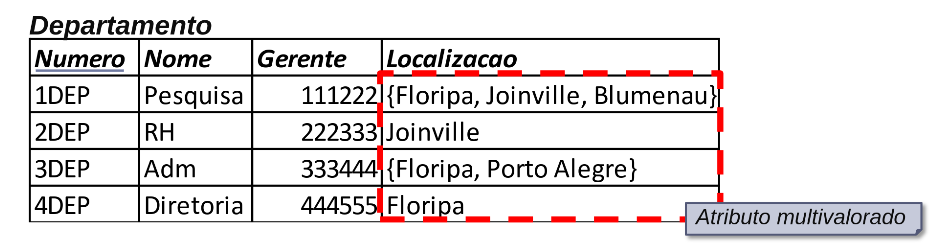


```python
# get_dummies()

df_enroll = pd.get_dummies(data=df_enroll,
                           columns=['is_canceled'],
                           dummy_na=True,
                           prefix_sep='_')
```

#### One-Hot Encondig Advanced: Feature Hashing
It is a technique used when you have many categorical features in the same column (high cardinality), such as a column with the name of all countries.

**Problems**: many collisions result in data loss

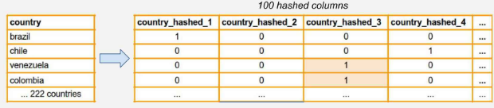


## Log Transform `np.log()`

_Compresses the range of large numbers and expand the range of small numbers._

- Features with very distorted distribution
- Decreases the importance of outliers
- Distribution closer to normal
- Lower Skew (nearest mean and median)

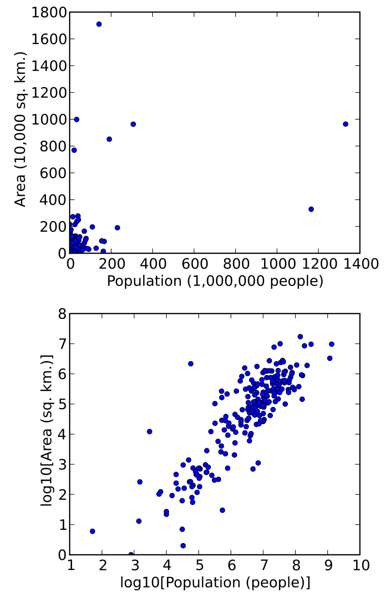

**NOTES**
- Does not help tree-based models 
- Very useful for neural networks, linear models, KNN


**Example**
- In the dataset below, the user _a_ was counted 2x more than the user _b_
- However, it doesn't matter if the user accesses 500 or 10000 times, he is already an outliers
- When applying the log, a new weight is given to the data
- Expand the differences between small values and contract the difference between large values

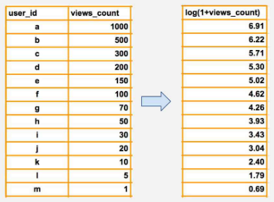

- features with highly skewed, necessary scaling (log transform)

```python
# Log feature
df_callcenter['duracao'] = [np.log(x) for x in df_callcenter['duracao']]
```

#### 0 of Log 
- Feature has a value of 0
- Log of 0 is undefined, so we have to increment the values by a small amount above 0 to apply the logarithm properly.


```python
def apply_log(df: 'dataframe' = None,
              fix: int = 0,
              type_col: 'number' = 'int16',
              column: str = None):
    
    skew_before = df[column].skew()
    df[column] = [np.log(x + fix).astype(type_col) for x in df[column]]
    skew_after = df[column].skew()
    
    return f'Skew before = {skew_before} -> Skew after = {skew_after}'
```

```python
def plot_distribuition(df: 'dataframe', column: str):
    plt.figure()
    df[column].plot.hist(alpha=0.5, color='blue')
    plt.title(f"Distribuição da Coluna {column}")
    plt.show()

    sns.boxplot(x=df[column],
                width=0.5,
                showfliers=True)
```


### Bin-counting
It is replacing a categorical value with a statistic from that feature.
For example, the name of each showcase becomes its conversion rate.
<br/>
The big advantage is that a decision tree will learn that the conversion rate has a great weight


### Algoritms
It is a great aid for decision tree and linear models.

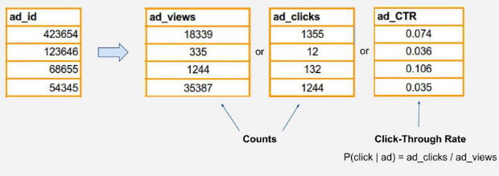

#### Frequency Enconding
- We can map these features to their frequency values.
- It is if the frequency of the value is correlated with the feture target.

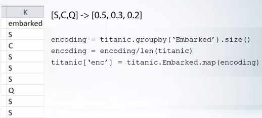

We can change the values accordingly: c to 0.3, s to 0. 5 and q to 0.2. 
<br/>
This will preserve some information about value distribution


#### Feature Scaling (normalization)
- `média = 0`.

In real life, it is absurd to expect the ** age ** and ** income ** columns to have the same range. But from the machine learing point of view how can these two columns be compared?

The scale technique (normalization) solves this problem.

- ** Adjusting the scale does not change the distribution, it just shifts. **
- Standardization ensures that each attribute will be treated with the same weight
- It is a feature operation (column).


#### NOTE
- Before applying scale, it is necessary to treat outliers.


#### Example
Use of 2 features with very different scales:
- height
- weight

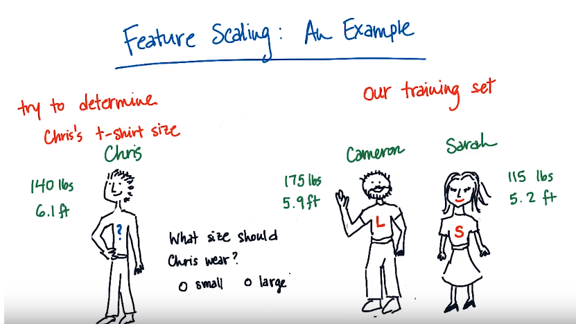

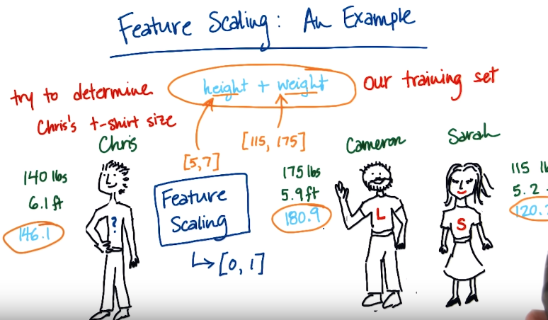


#### Algoritms
In general, algorithms that **exploit distances** between data samples, such as k-NN, SVM and neural networks, are sensitive to feature transformations.

- Data standardization becomes essential for these models.
- Decisions Trees are not affected!
 <br/>
  They are not affected because in the graph a decision tree is a series of vertical and horizontal lines.
  When making the scale, each box (decision) will be divided in a different place in relation to the X axis, but there will be no compensation between decisions.


### Min Max Scaler
interval: 0 until 1

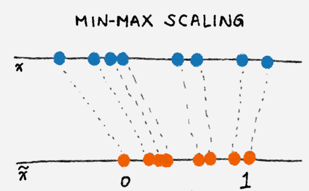


```python
from sklearn.preprocessing import MinMaxScaler


# trainnig data
scaler_transformer = MinMaxScaler().fit(df_callcenter[list_col_scale])
```

```python
# transform columns
df_callcenter[list_col_scale] = scaler_transformer.transform(df_callcenter[list_col_scale])

df_callcenter[list_col_scale].tail()

#       duracao	    qtd_contatos_campanha
# 41183	0.0679138	0.0
# 41184	0.0778772	0.0
# 41185	0.0384303	0.0181818
# 41186	0.0898739	0.0
# 41187	0.048597	0.0363636
```

### Standardization
- It is the application of the smoothest log
- It means changing the values so that the `standard deviation = 1`
- Changes the distribution, bringing it closer to a normal distribution.

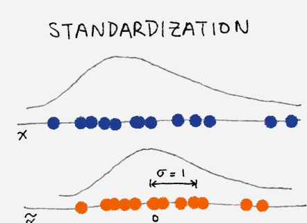


```python
from sklearn.preprocessing import StandardScaler

# trainnig data
scaler_transformer = StandardScaler().fit(df_callcenter[list_col_scale])
df_callcenter[list_col_scale] = scaler_transformer.transform(df_callcenter[list_col_scale])

df_callcenter[list_col_scale].tail()
```

---

## Feature Iteraction

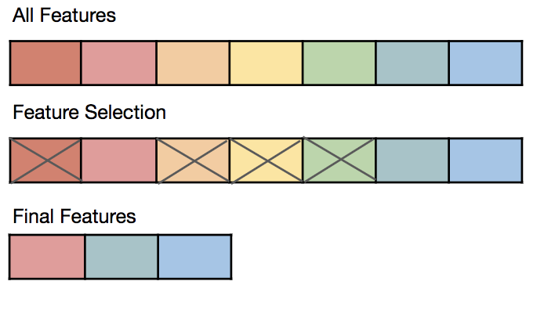


Example (real estate)

Let's say we already had a feature called `num_schools`, that is, the number of schools within 5 miles of a property.
<br/>
Let's say we also have the resource `median_school`, that is, the median quality score of these schools.
However, we may suspect that what is really important is having a lot of school options, but only if they are good.
Well, to capture this interaction, we could create a new resource `school_score` = `num_schools` x `median_school`.

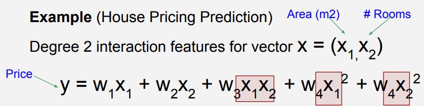

Simple linear models use a linear combination of the individual input features, x1, x2, ... xn to predict the outcome y.
- sum, diff, multiplication or division
- create feature combinations (nonlinear features).

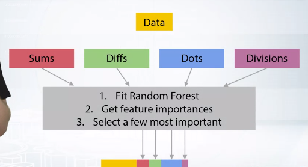


- Use domain knowledge to think about what interactions are likely


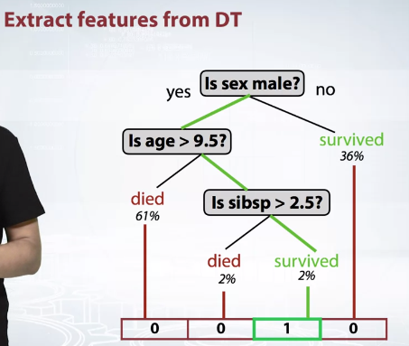


#### Example
Product pricing as a feature

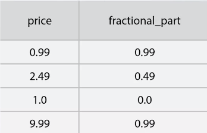

We can add a new feature indicating a fractional part of these prices.
<br/>
For example, if a product costs 2.49, the fractional part of its price is 0.49. This feature can help the model to use differences in people's perceptions of these prices.
<br/>
In addition, we can find similar patterns in tasks that require distinguishing between a human and a robot.

---

### Polynomial Features 
Generate a new feature matrix consisting of all polynomial combinations of the features

- Param: the degree-2 polynomial features are [1, a, b, a^2, ab, b^2].


```python
df_callcenter = pd.read_csv('data/raw/callcenter_marketing.csv', 
                            encoding='utf8',
                            delimiter=',')

list_col_scale = ['duracao', 'idade']
df_callcenter = df_callcenter[list_col_scale]

df_callcenter.head()

#   duracao	idade
# 0	261	    56
# 1	149	    57
# 2	226	    37
# 3	151	    40
# 4	307	    56
```

```python
# PolynomialFeatures()
from sklearn.preprocessing import PolynomialFeatures


# create object
poly = PolynomialFeatures(interaction_only=True,
                          include_bias=True,
                          degree=2)

# trainning and transform
feature_interaction = poly.fit_transform(df_callcenter)

print('Type feature_interaction = ', type(feature_interaction), end='\n\n')
display(poly.get_feature_names(df_callcenter.columns))
```


```python
# create dataframe
df_interaction = pd.DataFrame(data=feature_interaction,  # numpy array
                              columns=poly.get_feature_names(df_callcenter.columns))
df_interaction.head()

# 1	duracao	idade	duracao idade
# 0	1.0	    261.0	56.0	14616.0
# 1	1.0	    149.0	57.0	8493.0
# 2	1.0	    226.0	37.0	8362.0
# 3	1.0	    151.0	40.0	6040.0
# 4	1.0	    307.0	56.0	17192.0
```

<br/>

## Feature Selection
This step aims to find the best features.

The benefits of performing feature selection before modeling the model are as under:
- **Reduction in Model Overfitting**: Less redundant data implies less opportunity to make noise based decisions.
- **Improvement in Accuracy**: Less misleading and misguiding data implies improvement in modeling accuracy.
- **Reduction in Training Time**: Fewer data implies that algorithms train at a faster rate.

### Filtering Methods
- Finding the best correlation
- Statistical tests can be used to select those features that have the strongest relationship with the output variable. Mutual information, ANOVA F-test and chi square are some of the most popular methods of univariate feature selection.

### Embedded Methods
- Decision tree make the feature selection automatically, for example at each node it decides which is the best feature to do the split using the entropy information. So, it is possible to return a feature importance.

**What to do with the invoice importance? Remove the less important ones?**
- https://towardsdatascience.com/feature-selection-with-pandas-e3690ad8504b
- https://scikit-learn.org/stable/modules/feature_selection.html

```python
def get_feature_importance_df(feature_importances,
                              column_names, 
                              top_n=25):
    """Get feature importance data frame.
 
    Parameters
    ----------
    feature_importances : numpy ndarray
        Feature importances computed by an ensemble 
            model like random forest or boosting
    column_names : array-like
        Names of the columns in the same order as feature 
            importances
    top_n : integer
        Number of top features
 
    Returns
    -------
    df : a Pandas data frame"""
     
    imp_dict = dict(zip(column_names, feature_importances))
    
    # get name features sroted
    top_features = sorted(imp_dict, key=imp_dict.get, reverse=True)[0:top_n]
    
    # get values
    top_importances = [imp_dict[feature] for feature in top_features]
    
    # create dataframe with feature_importance
    df = pd.DataFrame(data={'feature': top_features, 'importance': top_importances})
    return df
```

```python
# create model
from sklearn.ensemble import RandomForestClassifier


rf = RandomForestClassifier(n_estimators=150, # numbers tree
                           max_depth=8,
                           min_samples_leaf=4,
                           max_features=0.2, # each tree utility 20% in the features
                           n_jobs=-1,
                           random_state=42)
```

```python
# trainning model
rf.fit(train.drop(['target'], axis=1), train.target)
features = train.drop(['target'], axis=1).columns.values
print("---Traing Done---")
```
```python
# get trained model (rf) and avalible the feature_importance
feature_importance = get_feature_importance_df(rf.feature_importances_, features)

# print 25 feature_importance in the rf randomForest
feature_importance

# 	   feature	    importance
# 0	   ps_car_13	    0.13
# 1	   ps_ind_05_cat	0.07
# 2	   ps_reg_03	    0.07
# 3	   ps_ind_17_bin	0.06
# 4	   ps_ind_03	    0.04
# 5	   ps_reg_02	    0.04
# 6	   id	            0.04
# 7	   ps_car_07_cat	0.03
# 8	   ps_car_04_cat	0.03
# 9	   ps_car_14	    0.03
# 10   ps_ind_15	    0.03

```

```python
fig,ax = plt.subplots()
fig.set_size_inches(20,10)
sns.barplot(data=feature_importance[:10],x="feature",y="importance",ax=ax,color=default_color,)
ax.set(xlabel='Variable name', ylabel='Importance',title="Variable importances")
```

```python
```
```python
```


### Checklist for Find the Best Features    
1. Do you have domain knowledge? If so, create a better set of ad hoc resources.
2. Are your features compatible? If not, consider normalizing them.
3. Do you suspect resource interdependence? If so, expand your resource pool by building resources or connective resource products as much as your computer's resources allow.
4. Do you need to remove input variables (for example, for reasons of cost, speed or understanding of data)? If not, build disjunctive resources or resource weighted sums
5. Do you need to evaluate the resources individually (for example, to understand their influence on the system or because they are so large that you need to do the first filter)? If so, use a variable classification method; more, do it anyway to get basic results.
6. Do you need a predictor? If not, stop
7. Do you suspect your data is “dirty” (it has some meaningless input patterns and / or noisy outputs or wrong class labels)? If so, detect the outlier examples using the main classification variables obtained in step 5 as a representation; check and / or discard them.
8. Do you know what to try first? If not, use a linear predictor. Use a forward selection method with the “probe” method as a stopping criterion or use the 0-norm embedded method for comparison, following the classification of step 5, build a sequence of predictors of the same nature using increasing subsets of resources. Can you combine or improve performance with a smaller subset? If so, try a nonlinear predictor with that subset.
9. Do you have enough new ideas, time, computational resources and examples? If so, compare several resource selection methods, including your new idea, correlation coefficients, reverse selection, and built-in methods. Use linear and non-linear predictors. Select the best approach with model selection
10. Do you want a stable solution (to improve performance and / or understanding)? If so, sub-specify your data and redo your analysis for several “bootstrap”.


---

## Machine Learning Fundamentals 
Basicamente, em computação, o machine Learning é sobre **aprender algumas propriedades** de um conjunto de dados e aplicá-las a novos dados. 

## Modeling a Problem Using Machine Learning
A modelagem de um problema usando machine learning tem o objetivo de desenvolver uma função de hypothesis **h**.

<br/>


<br/>

**NOTES**

_For historical reasons, this function h is called a hypothesis._
<br/>
Can also be called **predictive function** if calculates future events.


## Learning Types
- Supervised Learning
- Unsupervised Learning
- Reinforcement Learing


## Dataset train and dataset tests
O machine learning é sobre aprender algumas propriedades de um conjunto de dados e aplicá-las a novos dados.É por isso que uma prática comum em machine learning para avaliar um algoritmo é dividir os dados em dois conjuntos:

conjunto de train no qual aprendemos propriedades de dados.
conjunto de tests no qual testamos esses dados.


Aprender os parâmetros de uma função de previsão e testá-la nos mesmos dados é um erro metodológico: um modelo que apenas repetiria os rótulos das amostras que acabaram de ver teriam uma pontuação perfeita, mas não conseguiriam prever nada de útil no entanto.

Essa situação é chamada de overfitting . Para evitá-lo, é prática comum, ao realizar uma experiência de machine learning (supervised), reter parte dos dados disponíveis como um conjunto de tests.

---

### Extra Topic

#### Correlation and Causality
In most statistical studies applied to the social sciences, one is interested in the causal effect that one variable (for example, minimum wage) has on another (for example, unemployment). This kind of relationship is extremely difficult to discover. Often, what is found is an association (correlation) between two variables. Unfortunately, without establishing a causal relationship, correlation alone does not provide a solid basis for decision making (for example, raising or lowering the minimum wage to decrease unemployment).

_Na maioria dos estudos estatísticos aplicados às ciências sociais se está interessado no efeito causal que uma variável (por exemplo, salário mínimo) tem em outra (por exemplo, desemprego). Esse tipo de relação é extremamente difícil de descobrir. Muitas vezes, o que se consegue encontrar é uma associação (correlação) entre duas variáveis. Infelizmente, sem o estabelecimento de uma relação causal, apenas correlação não nos fornece uma base solida para tomada de decisão (por exemplo, subir ou baixar o salário mínimo para diminuir o desemprego)._

#### Ceteris Paribus
A very relevant concept for causal analysis is that of ceteris paribus, which `means all other (relevant) factors kept constant`. Most econometric issues are of a ceteris paribus nature. For example, when you want to know the effect of education on wages, we want to keep other relevant variables unchanged, such as family income. The problem is that it is rarely possible to literally keep “everything else constant”. The big question in empirical social studies is always then whether there are enough relevant factors being controlled (kept constant) to make causal inference possible.

_Um conceito bastante relevante para a análise causal é o de ceteris paribus, que `significa todos outros fatores (relevantes) mantidos constantes`. A maioria das questões econometricas são de natureza ceteris paribus. Por exemplo, quando se deseja saber o efeito da educação no salário, queremos manter inalteradas outras variáveis relevantes, como por exemplo a renda familiar. O problema é que raramente é possível manter literalmente “tudo mais constante”. A grande questão em estudos sociais empíricos sempre é então se há suficientes fatores relevantes sendo controlados (mantidos constantes) para possibilitar a inferência causal. _

---

#### Links
- [Understanding Machine Learning](https://vas3k.com/blog/machine_learning/)
- [Using Machine Learning to generate Super Mario Maker levels](https://medium.com/@ageitgey/machine-learning-is-fun-part-2-a26a10b68df3#.kh7qgvp1b)
- [Machine Learning Performance Improvement Cheat Sheet](https://machinelearningmastery.com/machine-learning-performance-improvement-cheat-sheet/)
- [Statistics for Machine Learning](https://machinelearningmastery.com/category/statistical-methods/)
- [Bias-Variance Trade-Off in Machine Learning](https://machinelearningmastery.com/gentle-introduction-to-the-bias-variance-trade-off-in-machine-learning/)
- [Interpretability X Accuracy](https://towardsdatascience.com/the-balance-accuracy-vs-interpretability-1b3861408062)

---

#### References
- [1] https://towardsdatascience.com/important-topics-in-machine-learning-you-need-to-know-21ad02cc6be5
- [2] https://towardsdatascience.com/interpretability-vs-accuracy-the-friction-that-defines-deep-learning-dae16c84db5c
- [3] http://blog.echen.me/2011/04/27/choosing-a-machine-learning-classifier/
- [4] https://stanford.edu/~shervine/l/pt/teaching/cs-229/dicas-aprendizado-supervisionado
- [5] https://medium.com/@contactsunny/label-encoder-vs-one-hot-encoder-in-machine-learning-3fc273365621
- [6] https://machinelearningmastery.com/how-to-one-hot-encode-sequence-data-in-python/
- [7] https://machinelearningmastery.com/discover-feature-engineering-how-to-engineer-features-and-how-to-get-good-at-it/
- [8] http://jmlr.csail.mit.edu/papers/volume3/guyon03a/guyon03a.pdf
- [9] https://towardsdatascience.com/understanding-feature-engineering-part-1-continuous-numeric-data-da4e47099a7b
- [10] https://www.coursera.org/learn/competitive-data-science/home/welcome
- [11] https://towardsdatascience.com/preprocessing-with-sklearn-a-complete-and-comprehensive-guide-670cb98fcfb9
- [12] feature engineering: https://www.infoq.com/br/presentations/extraindo-o-potencial-maximo-dos-dados-para-modelos-preditivos/ 
- [13] https://github.com/dipanjanS/practical-machine-learning-with-python/tree/master/notebooks/Ch04_Feature_Engineering_and_Selection
