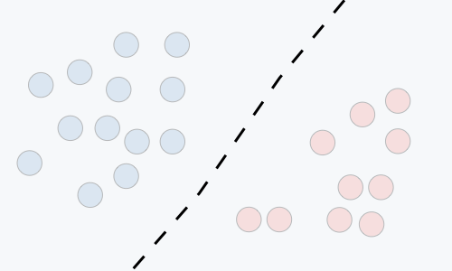
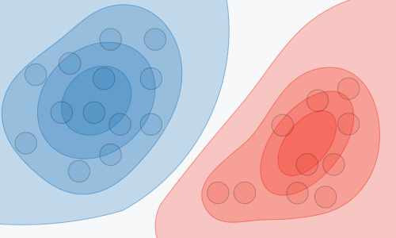

# machine-learning-algorithms

REFACTORING...

Intro: https://vas3k.com/blog/machine_learning/

Part 2: Using Machine Learning to generate Super Mario Maker levels: https://medium.com/@ageitgey/machine-learning-is-fun-part-2-a26a10b68df3#.kh7qgvp1b

general: https://github.com/rasbt/python-machine-learning-book

algoritmos: https://github.com/alexsosn/MarslandMLAlgo

- Data prepare
data leakage: http://machinelearningmastery.com/data-leakage-machine-learning/

https://machinelearningmastery.com/tactics-to-combat-imbalanced-classes-in-your-machine-learning-dataset/

- otimization: https://machinelearningmastery.com/machine-learning-performance-improvement-cheat-sheet/

1. Define the Problem
I like to use a three step process to define the problem. I like to move quickly and I use this mini process to see the problem from a few different perspectives very quickly:

Step 1: What is the problem? Describe the problem informally and formally and list assumptions and similar problems.
Step 2: Why does the problem need to be solved? List your motivation for solving the problem, the benefits a solution provides and how the solution will be used.
Step 3: How would I solve the problem? Describe how the problem would be solved manually to flush domain knowledge.

Statistics for Machine Learning: 
- https://machinelearningmastery.com/start-here/
- https://machinelearningmastery.com/category/statistical-methods/

Parametric and Nonparametric Machine Learning Algorithms
- https://machinelearningmastery.com/parametric-and-nonparametric-machine-learning-algorithms/

bias and variance:
- Bias-Variance Trade-Off in Machine Learning: https://machinelearningmastery.com/gentle-introduction-to-the-bias-variance-trade-off-in-machine-learning/

### Machine Learning Types

Rule Extraction: Data is used as the basis for the extraction of propositional rules (antecedent/consequent aka if-then). Such rules may, but are typically not directed, meaning that the methods discover statistically supportable relationships between attributes in the data, not necessarily involving something that is being predicted. An example is the discovery of the relationship between the purchase of beer and diapers (this is data mining folk-law, true or not, it’s illustrative of the desire and opportunity).

---

http://cursos.leg.ufpr.br/ML4all/1parte/
!!!

linear_algebra.png

interpretability.png

# What is machine learning ?
Basicamente, em computação, o machine Learning é sobre **aprender algumas propriedades** de um conjunto de dados e aplicá-las a novos dados. 

## Appications of Machine Learning
As aplicações mais comuns, ou seja, os problemas que machine learing resolve são:

#### Classification
`O QUE É ISSO?`

| Hours | Score |
|-------|-------|
| 10    | PASS  |
| 9     | PASS  |
| 7     | ?     |
| 3     | FAIL  |

Uma subcategoria de Aprendizado supervisionado, Classificação é o processo de tomar algum tipo de entrada e atribuir um rótulo a ela. Os sistemas de classificação geralmente são usados ​​quando as previsões são de natureza discreta ou “sim ou não”. Exemplo: Mapear uma imagem de alguém para uma classificação masculina ou feminina.

#### Regression
`QUANTO É?`

| Hours | Score |
|-------|-------|
| 10    | 90    |
| 9     | 80    |
| 7     | ?     |
| 3     | 50    |

Outra subcategoria de aprendizado supervisionado é usada quando o valor que está sendo previsto difere de um rótulo “sim ou não”, por estar em algum lugar em um espectro contínuo. Sistemas de regressão poderiam ser usados, por exemplo, para responder a perguntas sobre “quanto?” Ou “quantos?”.

### Clustering
`QUAIS SÃO OS GRUPOS?`

### Decision
` O QUE FAÇO AGORA?`

reinforcement Learning

## Algoritm Types

### Linear 
- Linear Regression

### Tree
- Decision Tree

### Bayes

## Model Types

|                   | Modelo discriminativo            | Modelo generativo                                  |
|-------------------|----------------------------------|----------------------------------------------------|
| Goal          | Estimar diretamente P(y/x)P(y/x) | Estimar P(x/y)P(x/y) para daí deduzir P(y|x)P(y|x) |
| O que é aprendido | Fronteira de decisão             | Probabilidade da distribuição dos dados            |
| Ilustração        |                                  |                                                     |
| Exemplos          | Regressões, SVMs                 | GDA, Naive Bayes                                   |

## Modeling a Problem Using Machine Learning
A modelagem de um problema usando machine learning tem o objetivo de desenvolver uma função de hypothesis **h**.
 
 

 
 
 
 
 
 
 
 
 
 
 

**NOTES**

_For historical reasons, this function h is called a hypothesis._
 
 
Can also be called **predictive function** if calculates future events.

## Learning Types
1. Supervised Learning
2. Unsupervised Learning
3. Reinforcement Learing

# Supervised Learning
Uma aprendizagem deste tipo apresenta problemas do tipo classification e regression. A principal diferença entre classification e regression é que na classification, nós **prevemos um estado**, enquanto, na regression, **prevemos um valor.**

Podemos usar algortimos matemáticos para modelar os problemas supervisionados:
* ## Linear regression
    * [Papyrus]()
    * [Exercices]()
- ## Perceptrons
    * [Papyrus]()
    * [Exercices]()
* ## Decision tree
    * [Papyrus]()
    * [Exercices]()
* ## Naive bayes
    * [Papyrus]()
    * [Exercices]()
* ## Suport Vectorial Machine
     * [Papyrus]()
     * [Exercices]()
* ## Ensembles methods
     * [Papyrus]()
     * [Exercices]()

## Advantages and Disadvantages of the models

### Logistic Regression
#### Advantages
 - Don’t have to worry about features being correlated
 - You can easily update your model to take in new data (unlike Decision Trees or SVM)
 
#### Disadvantages
 - Deals bad with outliers
 - Must have lots of incomes for each class
 - Presence of multicollinearity
 
 
### Decision Tree
#### Advantages
 - Easy to understand and interpret (for some people)
 - Easy to use - Doesn’t need data normalisation, dummy variables, etc
 - Can handle multi-output models
 - Easily handle feature interactions
 - Don’t have to worry about outliers
 
#### Disadvantages
 - It can be easily overfitted
 - Stability —> small changes in data can lead to completely different trees
 - If a class dominates, it can easily be biased
 - Don’t support online learning –> you should rebuilt the tree when new data comes

### SVM
#### Advantages
 - High accuracy
 - Nice theoretical guarantees regarding overfitting
 - Especially popular in text classification problems
 
#### Disavantages
 - Memory-intensive
 - Hard to interpret
 - Complicated to run and tune
 

### Ensemble Methods
#### Advantages
 - Harder to overfit
 - Usually better perfomance than a single model
 
#### Disadvantages
 - Scaling —> usually it trains several models, which can have a bad performance with larger datasets
 - Hard to implement in real time platform
 - Complexity increases
 - Boosting delivers poor probability estimates (https://arxiv.org/ftp/arxiv/papers/1207/1207.1403.pdf)

---
# Reinforcement learning
 - A estrutura da aprendizagem por reforço: o problema
 - A estrutura da aprendizagem por reforço: a solução
 - Programação dinâmica
 - Métodos de Monte Carlo
 - Métodos de diferença temporal (TD)
 - Aprendizagem por reforço em espaços contínuos
 - Aprendizado-Q profundo
 - Gradientes de política
 - Métodos ator-críticos

# untopic

## Causalidade e Ceteris Paribus
Na maioria dos estudos estatísticos aplicados às ciências sociais se está interessado no efeito causal que uma variável (por exemplo, salário mínimo) tem em outra (por exemplo, desemprego). Esse tipo de relação é extremamente difícil de descobrir. Muitas vezes, o que se consegue encontrar é uma associação (correlação) entre duas variáveis. Infelizmente, sem o estabelecimento de uma relação causal, apenas correlação não nos fornece uma base solida para tomada de decisão (por exemplo, subir ou baixar o salário mínimo para diminuir o desemprego).

Um conceito bastante relevante para a análise causal é o de ceteris paribus, que `significa todos outros fatores (relevantes) mantidos constantes`. A maioria das questões econometricas são de natureza ceteris paribus. Por exemplo, quando se deseja saber o efeito da educação no salário, queremos manter inalteradas outras variáveis relevantes, como por exemplo a renda familiar. O problema é que raramente é possível manter literalmente “tudo mais constante”. A grande questão em estudos sociais empíricos sempre é então se há suficientes fatores relevantes sendo controlados (mantidos constantes) para possibilitar a inferência causal.

---
# Unsupervised Learning
- Clustering
 - Clustering hierarquico
 - Modelos de mistura de gaussianas e validação de cluster
 - Dimensionamento de atributos
 - Análise de componentes principais

---

# Deep Learning
- [Perceptros](#perceptros)
- [Neural Networks](#neural-networks)
- [Convolutional Networks](convolutional_networks)

## Interpretability X Accuracy
- https://towardsdatascience.com/interpretability-vs-accuracy-the-friction-that-defines-deep-learning-dae16c84db5c
https://towardsdatascience.com/the-balance-accuracy-vs-interpretability-1b3861408062

Muitas críticas a métodos de aprendizado profundo e algoritmos de aprendizado de máquina, como o Support Vector Machine 

Um dos melhores exemplos de interpretabilidade são as árvores de decisão, nas quais você segue testes lógicos nos nós da árvore até chegar a uma decisão. 

#### References
- [1] https://towardsdatascience.com/important-topics-in-machine-learning-you-need-to-know-21ad02cc6be5
- [2] https://towardsdatascience.com/interpretability-vs-accuracy-the-friction-that-defines-deep-learning-dae16c84db5c
- [3] http://blog.echen.me/2011/04/27/choosing-a-machine-learning-classifier/
- [4] https://stanford.edu/~shervine/l/pt/teaching/cs-229/dicas-aprendizado-supervisionado