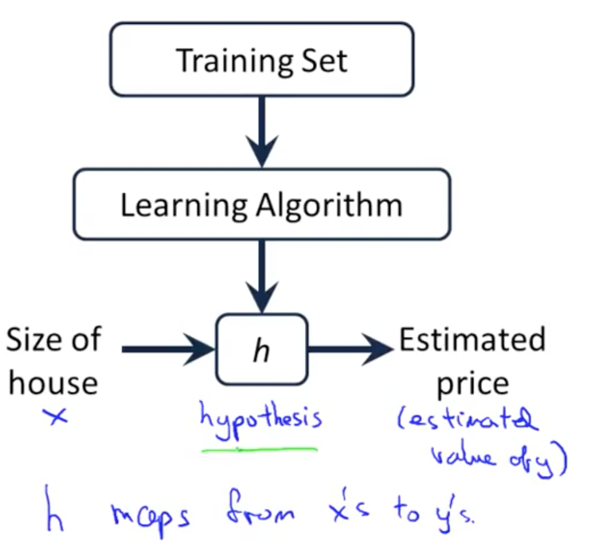
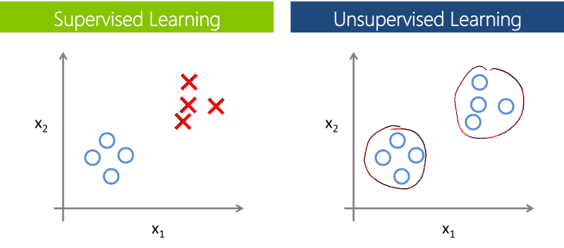

## Summary
### Basic
- [probabilit_and_statistics](#probabilit_and_statistics)
- [CRISP_DM](#crisp_dm)

### Machine Learning
- [linear_models](#linear_models)
- [naive_bayes](#naive_bayes)
- [decision_tree](#decision_tree)
- [association_rules](#association_rules)
- [ensemble](#ensemble)
- [reinforcement_learning](#reinforcement_learning)

### Deep Learning
- [Perceptros](#perceptros)
- [Neural Networks](#neural-networks)

---

## Probabilit 
...

## Statistics
...


## CRISP-DM
...

#### Identificar o problema
Há muitos tipos diferentes de questões que podem ser resolvidos pela ciência de dados. Exemplos incluem insights sobre doenças, previsões de vendas e falhas de hardware. Uma empresa que se depara com uma pergunta que pode ser respondida com o uso de dados pode decidir contratar uma equipe de ciência de dados para resolver o problema.
No exemplo de sua empresa, o problema relacionado aos negócios é que o estoque de vassouras acaba antes do fim do mês. Portanto, a empresa busca repor o estoque de vassouras de acordo com a previsão de vendas de vassouras.

### Definir as metas do projeto
A definição das metas e dos objetivos do projeto começa com perguntas específicas e relevantes para entender o escopo do projeto. Sua empresa deseja resolver o problema com as vendas de vassouras, mas o escopo do projeto precisa ser definido primeiro. No âmbito do projeto, a empresa e sua equipe de ciência de dados precisam definir metas e objetivos, como identificar uma data limite e os marcos do projeto.

### Identificar as fontes de dados
A maioria das empresas tem uma enorme quantidade de dados, portanto, é essencial decidir quais tipos de dados são necessários para o projeto. Em seguida, é preciso determinar o local em que eles são armazenados e como obter acesso aos dados. Dependendo do local em que sua empresa armazena os dados, cabe aos engenheiros de dados obter os dados da fonte de dados da empresa, limpar os dados e entregá-los ao cientista de dados.


### Bizus
Vencedores de competições de data science fazem suas modelagens sempre pensando em qual modelo vão usar. Por exemplo:
- modelos baseados em trees
- modelos lineares


### Prepare Environment
#### Directory Structure
```
├── setup.py           <- Make this project pip installable with `pip install -e`
│  
├── LICENSE
│
├── README.md          <- The top-level README for developers using this project.
│
├── .gitignore
|
├── .gitatributes
│
├── requirements.txt   <- The requirements file for reproducing the analysis environment, e.g.
│                         generated with `pip freeze > requirements.txt`
│  
├── config-environment <- get configurations
│  
├── data/              <- view TAGs
│
├── notebooks/         <- Jupyter notebooks. Naming convention is a number (for ordering),
│                         the creator's initials, and a short `-` delimited description, e.g.
│                         `1.0-jqp-initial-data-exploration`.
│
├── references/        <- Data dictionaries, manuals, and all other explanatory materials.
│
├── reports/           <- Generated analysis as HTML, PDF, LX, graphics and figures to be used in reporting.
│
├── src/               <- Source code for use in this project.
    ├── __init__.py    <- Makes src a Python module
    │
    ├── make_dataset.py <- Scripts to download or generate data
```
NOTE: this structure is similary with coockiecutter data science

#### Data
- **raw** <- The original, immutable data dump.
- **external** <- Data from third party sources.
- **processed** <- The final, canonical data sets for modeling.


Notebooks are for exploration and communication

#### Name of notebook
format: `<step><description>.ipynb`
<br/>
Example: `0.3-visualize-distributions.ipynb`


#### Imports
Organize all imports in same cell.
```python
# Data analysis and data wrangling
import numpy as np
import pandas as pd

# Plotting
import seaborn as sns
import matplotlib.pyplot as plt
import missingno as msno

# PCA
from sklearn.preprocessing import StandardScaler
from sklearn.decomposition import PCA
from mpl_toolkits.mplot3d import Axes3D

# Preprocessing
from sklearn.preprocessing import LabelEncoder

# Machine learning
from sklearn.linear_model import LinearRegression
from sklearn.ensemble import RandomForestRegressor

# Metrics
from sklearn.metrics import mean_absolute_error
from sklearn.model_selection import KFold

# Dataset
from sklearn.datasets import load_iris

# Other
from IPython.display import Image
import configparser
import subprocess
import warnings
import pprint
import time
import os
```

#### Prepare Principal Directory
```python
def prepare_directory_work(end_directory: str='notebooks'):
    # Current path
    curr_dir = os.path.dirname (os.path.realpath ("__file__")) 
    
    if curr_dir.endswith(end_directory):
        os.chdir('..')
        return curr_dir
    
    return f'Current working directory: {curr_dir}'
```

#### Graphics Format
```python
config = configparser.ConfigParser()
config.read('src/visualization/plot_config.ini')

figure_titlesize = config['figure']['figure_titlesize']
figure_figsize_large = int(config['figure']['figure_figsize_large'])
figure_figsize_width = int(config['figure']['figure_figsize_width'])
figure_dpi = int(config['figure']['figure_dpi'])
figure_facecolor = config['figure']['figure_facecolor']
figure_autolayout = bool(config['figure']['figure_autolayout'])
savefig_format = config['figure']['savefig_format']
savefig_dpi = int(config['figure']['savefig_dpi'])

axes_labelsize = int(config['axes']['axes_labelsize'])
axes_titlesize = int(config['axes']['axes_labelsize'])

lines_antialiased = bool(config['line']['lines_antialiased'])
lines_linewidth = int(config['line']['lines_linewidth'])
lines_color = config['line']['lines_color']

hist_bins = int(config['histogram']['hist_bins'])

boxplot_vertical = bool(config['boxplot']['boxplot_vertical'])
boxplot_showmeans = bool(config['boxplot']['boxplot_showmeans'])
boxplot_showbox = bool(config['boxplot']['boxplot_showbox'])
boxplot_flierprops_color = config['boxplot']['boxplot_flierprops_color']
boxplot_flierprops_markerfacecolor = config['boxplot']['boxplot_flierprops_markerfacecolor']
boxplot_flierprops_markersize = int(config['boxplot']['boxplot_flierprops_markersize'])
boxplot_meanprops_linewidth = int(config['boxplot']['boxplot_meanprops_linewidth'])

font_family = config['font']['font_family']
font_size = int(config['font']['font_size'])

legend_loc = config['legend']['legend_loc']
legend_fontsize = int(config['legend']['legend_fontsize'])


# matplotlib rcParams
# ===================
import matplotlib.pyplot as plt

plt.style.use('fivethirtyeight')

# Figure
plt.rcParams['figure.titlesize'] = figure_titlesize
plt.rcParams['figure.figsize'] = [figure_figsize_large, figure_figsize_width] 
plt.rcParams['figure.dpi'] = figure_dpi
plt.rcParams['figure.facecolor'] = figure_facecolor
plt.rcParams['figure.autolayout'] = figure_autolayout

plt.rcParams['savefig.format'] = savefig_format
plt.rcParams['savefig.dpi'] = savefig_dpi

# Axes
plt.rcParams['axes.labelsize'] = axes_labelsize
plt.rcParams['axes.titlesize'] = axes_titlesize

# Lines
plt.rcParams['lines.antialiased'] = lines_antialiased
plt.rcParams['lines.linewidth'] = lines_linewidth
plt.rcParams['lines.color'] = lines_color
 
# Histogram Plots
plt.rcParams['hist.bins'] = hist_bins

# Boxplot
plt.rcParams['boxplot.vertical'] = boxplot_vertical
plt.rcParams['boxplot.showmeans'] = boxplot_showmeans
plt.rcParams['boxplot.showbox'] = boxplot_showbox
plt.rcParams['boxplot.flierprops.color'] = boxplot_flierprops_color
plt.rcParams['boxplot.flierprops.markerfacecolor'] = boxplot_flierprops_markerfacecolor
plt.rcParams['boxplot.flierprops.markersize'] = boxplot_flierprops_markersize
plt.rcParams['boxplot.meanprops.linewidth'] = boxplot_meanprops_linewidth

# Font
plt.rcParams['font.family'] = font_family
plt.rcParams['font.size'] = font_size

# Legend
plt.rcParams['legend.loc'] = legend_loc
plt.rcParams['legend.fontsize'] = legend_fontsize


# Seaborn rcParams
# ===================
rc={'savefig.dpi': 500, 
    'figure.autolayout': True, 
    'figure.figsize': [18, 8], 
    'axes.labelsize': 18,
    'axes.titlesize': 18, 
    'font.size': 15, 
    'lines.linewidth': 1.0, 
    'lines.markersize': 8, 
    'legend.fontsize': 15,
    'xtick.labelsize': 15, 
    'ytick.labelsize': 15}

sns.set(font=font_family,
        style='darkgrid',
        palette='deep',
        color_codes=True,
        rc=rc)
```

#### Cell Format
```python
# Guarantees visualization inside the jupyter
%matplotlib inline

# OPTIONAL: Load the "autoreload" extension so that code can change
%load_ext autoreload

# Format the data os all table (float_format 3)
pd.set_option('display.float_format', '{:.6}'.format)

# Print xxxx rows and columns
pd.set_option('display.max_rows', None)
pd.set_option('display.max_columns', None)

# Supress unnecessary warnings so that presentation looks clean
warnings.filterwarnings('ignore')

# Pretty print
pp = pprint.PrettyPrinter(indent=4)
```

#### Hiden Code 
```javascript
%%html

<script>
code_show = true;

function code_display() {
    if (!code_show) {
        $('div.input').each(function (id) {
            $(this).show();
        });
        $('div.output_prompt').css('opacity', 1);
    } else {
        $('div.input').each(function (id) {
            if (id == 0 || $(this).html().indexOf('hide_code') > -1) {
                $(this).hide();
            }
        });
        $('div.output_prompt').css('opacity', 0);
    }
    ;
    code_show = !code_show;
}

$(document).ready(code_display);
</script>

<form action="javascript: code_display()">
    <input style="color: #0f0c0c; background: LightGray; opacity: 0.8;" \
    type="submit" value="Click to display or hide code cells">
</form>
``` 

---

## Machine Learning Fundamentals 
Basicamente, em computação, o machine Learning é sobre **aprender algumas propriedades** de um conjunto de dados e aplicá-las a novos dados. 

## Modeling a Problem Using Machine Learning
A modelagem de um problema usando machine learning tem o objetivo de desenvolver uma função de hypothesis **h**.

<br/>



<br/>

**NOTES**

_For historical reasons, this function h is called a hypothesis._
<br/>
Can also be called **predictive function** if calculates future events.


## Learning Types
- Supervised Learning
- Unsupervised Learning
- Reinforcement Learing




## Dataset train and dataset tests
O machine learning é sobre aprender algumas propriedades de um conjunto de dados e aplicá-las a novos dados.É por isso que uma prática comum em machine learning para avaliar um algoritmo é dividir os dados em dois conjuntos:

conjunto de train no qual aprendemos propriedades de dados.
conjunto de tests no qual testamos esses dados.


Aprender os parâmetros de uma função de previsão e testá-la nos mesmos dados é um erro metodológico: um modelo que apenas repetiria os rótulos das amostras que acabaram de ver teriam uma pontuação perfeita, mas não conseguiriam prever nada de útil no entanto.

Essa situação é chamada de overfitting . Para evitá-lo, é prática comum, ao realizar uma experiência de machine learning (supervised), reter parte dos dados disponíveis como um conjunto de tests.

---

### Extra Topic

#### Correlação e Causalidade 
Na maioria dos estudos estatísticos aplicados às ciências sociais se está interessado no efeito causal que uma variável (por exemplo, salário mínimo) tem em outra (por exemplo, desemprego). Esse tipo de relação é extremamente difícil de descobrir. Muitas vezes, o que se consegue encontrar é uma associação (correlação) entre duas variáveis. Infelizmente, sem o estabelecimento de uma relação causal, apenas correlação não nos fornece uma base solida para tomada de decisão (por exemplo, subir ou baixar o salário mínimo para diminuir o desemprego).

#### Ceteris Paribus
Um conceito bastante relevante para a análise causal é o de ceteris paribus, que `significa todos outros fatores (relevantes) mantidos constantes`. A maioria das questões econometricas são de natureza ceteris paribus. Por exemplo, quando se deseja saber o efeito da educação no salário, queremos manter inalteradas outras variáveis relevantes, como por exemplo a renda familiar. O problema é que raramente é possível manter literalmente “tudo mais constante”. A grande questão em estudos sociais empíricos sempre é então se há suficientes fatores relevantes sendo controlados (mantidos constantes) para possibilitar a inferência causal.


---

#### Links
- [Understanding Machine Learning](https://vas3k.com/blog/machine_learning/)
- [Using Machine Learning to generate Super Mario Maker levels](https://medium.com/@ageitgey/machine-learning-is-fun-part-2-a26a10b68df3#.kh7qgvp1b)
- [Machine Learning Performance Improvement Cheat Sheet](https://machinelearningmastery.com/machine-learning-performance-improvement-cheat-sheet/)
- [Statistics for Machine Learning](https://machinelearningmastery.com/category/statistical-methods/)
- [Bias-Variance Trade-Off in Machine Learning](https://machinelearningmastery.com/gentle-introduction-to-the-bias-variance-trade-off-in-machine-learning/)
- [Interpretability X Accuracy](https://towardsdatascience.com/the-balance-accuracy-vs-interpretability-1b3861408062)

---

#### References
- [1] https://towardsdatascience.com/important-topics-in-machine-learning-you-need-to-know-21ad02cc6be5
- [2] https://towardsdatascience.com/interpretability-vs-accuracy-the-friction-that-defines-deep-learning-dae16c84db5c
- [3] http://blog.echen.me/2011/04/27/choosing-a-machine-learning-classifier/
- [4] https://stanford.edu/~shervine/l/pt/teaching/cs-229/dicas-aprendizado-supervisionado