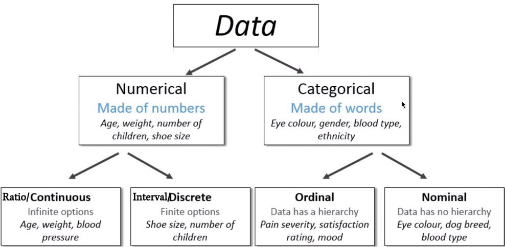
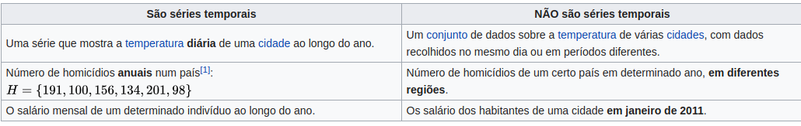
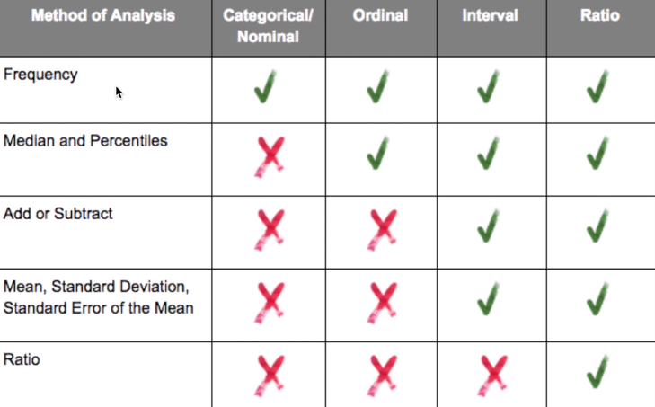

# Statisticals

- Medidas de tendência central: média, mediana, moda.
- Medidas de dispersão: intervalo interquartil, outliers, desvio-padrão, correção de Bessel.

- Amostra de Dados : Um subconjunto de observações de um grupo.
- População de Dados : Todas as observações possíveis de um grupo.

# Data Types

## Numeric Data (quatitatives)
 - Continuos
 - Discrete

## Categorical Data
- Represents characteristcs. Ex: position, team, hometown
<table>
  <tr>
    <th>characteristcs</th>
    <th>Value</th>
  </tr>
  <tr>
    <td>position</td>
    <td>high</td>
  </tr>
  <tr>
    <td>team</td>
    <td>Flamengo</td>
  </tr>
</table>
- Can take an numerical values **but they don´t have mathematical meaning.** 
Ex: 
<table>
  <tr>
    <th>Categorical</th>
    <th>Value</th>
  </tr>
  <tr>
    <td>man</td>
    <td>1</td>
  </tr>
  <tr>
    <td>woman</td>
    <td>0</td>
  </tr>
</table>

- Ordinal data
Data categorical with some order or ranking.

## Time-Series Data
Data colleted via repeted measurements over time. Has temporal order. Ex:

## Analysis

---

# Amostras

Como fazer uma amostra ?
- As vezes preciso dizer a resposta exata, ou seja 100% de certeza
- E outras vezes preciso de de velocidade.

Ex:
tenho 200 milhões de linhas, onde tem dados de usuário. Preciso saber quantos são homens e quantos são mulhers.

- Qual o tamanho da amostra preciso gerar nestes dados ?
- QUal a margem de erro q aceito ?
- Qual o nível de confiança do meu resultado ?
Então tenho 3 variáveis: margem de erro, nível de confiança e tamanho da amostra
- quanto mais aumento a amostra menor é meu nível de erro
- mais precisao, maior amostra

calcular tamanho da amostra:
tamanho_da_amostra = (z * sdtdev / margem_erro)*2

z é o z-score (ex, 995 o z-score é x)
sdtdev = desvio padrão da amostra
se vc não sabe o tamanho da amostra, use 0.5
margem_erro = 1 % de erro, ou seja, 0.01

então o tamanho da amostra deu 16 mil

aplicando na pop então preciso de 14 mil clientes

| Population     | Sample |
|----------------|--------|
| 100.000        | 14.229 |
| 1.000.000      | 15.927 |
| 10.00.000      | 16.560 |
| 1.000.000.000  | 16.587 |
| 10.000.000.000 | 16.587 |
...

Então com 16.587 vc consegue ter o tamanho ideal para aplicar estatítica. Geralmente a diferença entre a amostra de 16mil com a popo total vai ser nas casas decimais. 
- Sempre pegue randomizamente.

### Técnica ABC(aproximate Bayesian Computation)
...

#### Referência
- Fabiane Nardon: https://www.youtube.com/watch?v=QQz32BZTDFo
