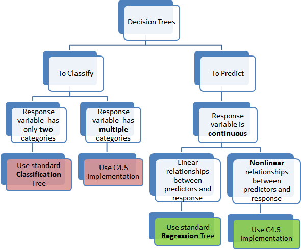
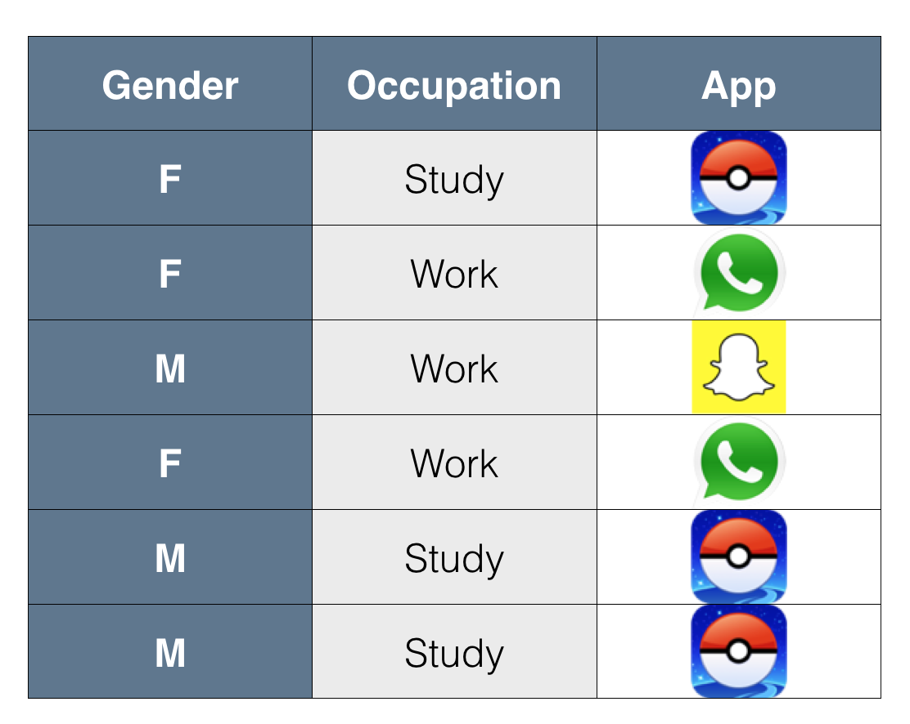
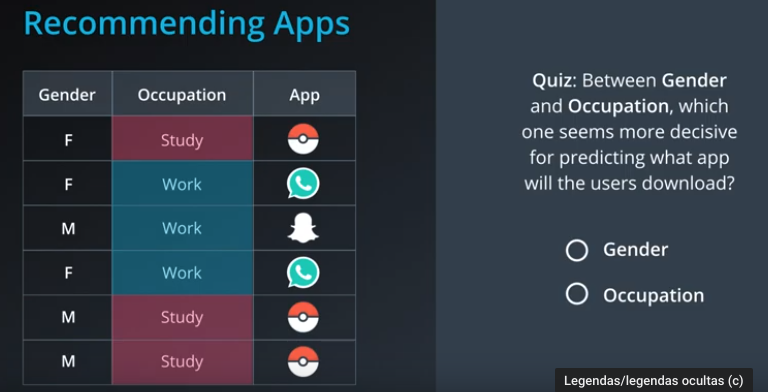
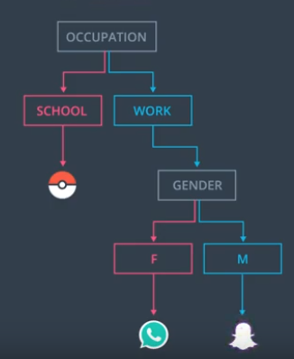
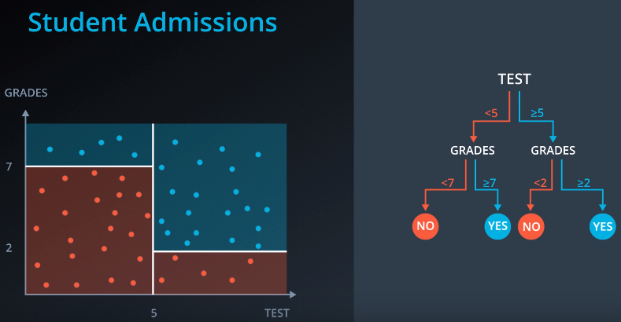
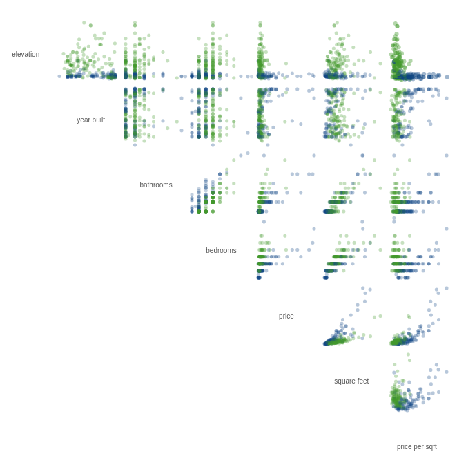
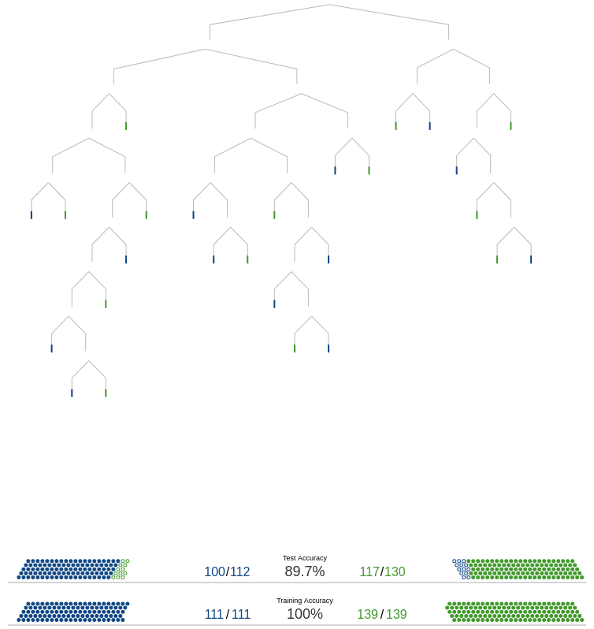
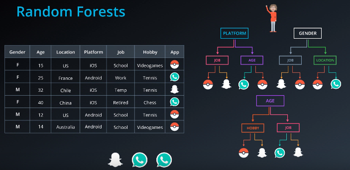

# Decision Tree

Decision Tree is a algoritm of _supervised learning_ of classifier e regressor.

aprendendo regras de decisão inferidas de dados anteriores (dados de treinamento).


dividimos a população ou amostra em dois ou mais conjuntos homogêneos (ou subpopulações) com base no divisor / diferenciador mais significativo em variáveis ​​de entrada.

as árvores de decisão são tipicamente desenhadas de cabeça para baixo, de tal forma que as folhas são o fundo e as raízes são os topos.


Nem todos os problemas podem ser resolvidos com métodos lineares. O mundo não é linear. Foi observado que os modelos baseados em árvores foram capazes de mapear a não linearidade de forma eficaz.


Common terms used with Decision trees:

- **Root Node:** It represents entire population or sample and this further gets divided into two or more homogeneous sets.

- **Splitting:** It is a process of dividing a node into two or more sub-nodes.
Decision Node: When a sub-node splits into further sub-nodes, then it is called decision node.

- **Leaf/ Terminal Node:** Nodes do not split is called Leaf or Terminal node.

- **Pruning:** When we remove sub-nodes of a decision node, this process is called pruning. You can say opposite process of splitting.

- **Branch:** A sub section of entire tree is called branch or sub-tree.


**Classifier**

Árvore de classificação, pois o objetivo é classificar o passageiro como sobrevivente ou morto.

```python
from sklearn import tree

X = [[0, 0], [1, 1]]
Y = [0, 1]

model = tree.DecisionTreeClassifier()
model = model.fit(X, Y)
```

**Regressor**

As árvores de regressão são representadas da mesma maneira, apenas predizem valores contínuos como o preço de uma casa.

```python
from sklearn import tree

X = [[0, 0], [1, 1]]
Y = [0, 1]

model = tree.DecisionTreeRegressor()
model = model.fit(X, Y)
```
## Árvores de regressão vs árvores de classificação





1. Árvores de regressão são usadas quando a variável dependente é contínua. Árvores de Classificação são usadas quando a variável dependente é categórica.

2. No caso da Árvore de Regressão, o valor obtido pelos nós terminais nos dados de treinamento é a resposta média da observação que cai naquela região.

3. No caso da Árvore de Classificação, o valor (classe) obtido pelo leaf nos dados de treinamento é o valor final.

## When use

- It's use to recomentation systems



#### Avalable which feature has more important



Start importance each feature, can mount decision tree.


problemas de categorização<br/>
exemplo, uma árvore de decisão pode ser usada efetivamente para determinar as espécies de um animal.


Exemplos de aplicativos incluem:

· Avaliação de oportunidades de expansão de marca para uma empresa usando dados históricos de vendas

· Determinação de prováveis ​​compradores de um produto usando dados demográficos para permitir a segmentação de orçamento de publicidade limitada

· Previsão da probabilidade de inadimplência de tomadores recorrentes usando modelos preditivos gerados a partir de dados históricos

· Ajuda na priorização do tratamento de pacientes em pronto-socorro usando um modelo preditivo baseado em fatores como idade, pressão arterial, sexo, localização e gravidade da dor e outras medidas.

· Árvores de decisão são comumente usadas em pesquisa operacional, especificamente em análise de decisão, para ajudar a identificar uma estratégia com maior probabilidade de atingir uma meta.


## Advantages

 - **Simples de entender e interpretar**: Árvores podem ser visualizadas.
 - **Requer pouca preparação de dados**: Outras técnicas geralmente requerem a normalização de dados e variáveis dummy. Não é influenciado por outliers ou missing values, geralmente.
 - **O custo de prever é logarítmico.**
 - **Capaz de lidar com dados numéricos e categóricos**
 - Capaz de lidar com problemas de várias saídas. (dimensões no eixo x)
 - **Possível validar um modelo usando testes estatísticos** Isso torna possível explicar a confiabilidade do modelo.

 #### HINT!
Um método para fazer árvores de decisão, que usa uma série de instruções **if-else** para identificar limites e definir padrões nos dados.

-  é recomendável equilibrar o conjunto de dados antes de se ajustar à árvore de decisão.

## Examples



## Add Features in tree

 - Forks adicionarão novas informações que podem aumentar a precisão da previsão da árvore.


### Example:
 - Prever se os imóveis localizados ficam em São Francisco ou em Nova Iorque.
 - O conjunto de dados que estamos usando para criar o modelo tem 7 dimensões diferentes.
 - Abaixo há o gráfico de dispersão para mostrar as relações entre cada par de dimensões. Existem claramente padrões nos dados, mas os limites para deliná-los não são óbvios.



 - Como temos várias dimensões, podemos utilizar uma árvore de decisão para analisar essas variáveis dependentes.
 - Na imagem abaixo temos, 82% de precisão


 * 84% de precisão


 * 100% de precisão


## Random Florest
 Uma árvore de decisão pode não generalizar bem se houver muitos ramos e acabar gerando um overfitting.


Com os dados de treino, o modelo de decision tree se saiu perfeito (precisão = 100%) mas com dados novos acabou fazendo um overfitting



Para evitar o **erro de overfitting**, criamos uma floresta de decisão.
Pegamos colunas aleatórias e fazemos fazemos algumas árvores de decisão.



## Hyperparameters for Decision Trees

### max_depth
Uma profundidade grande muito frequentemente causa um **sobreajuste**, já que uma árvore que é muito profunda pode memorizar os dados.


### min_samples_split

- Define o número mínimo de amostras (ou observações) que são necessárias em um nó a ser considerado para divisão.

- Amostras mínimas pequenas por folha podem resultar em folhas com muito poucas amostras, o que faz o que o modelo memorize os dados (**overfitting**).

- Valores mais altos impedem que um modelo aprenda relações que podem ser altamente específicas para a amostra particular selecionada para uma árvore.

- **n_features**: o número de features a serem amostrados e passados ​​em cada árvore.


## Como uma árvore decide onde dividir?
A decisão de fazer divisões estratégicas afeta fortemente a precisão de uma árvore. O critério de decisão é diferente para as árvores de classificação e regressão.

As árvores de decisão usam vários algoritmos para decidir dividir um nó em dois ou mais subnós.

Os quatro algoritmos mais usados ​​na árvore de decisão são:
- Índice de Gini
- Qui-quadrado


## Os modelos baseados em árvores são melhores que os modelos lineares?

 Depende do tipo de problema que estamos resolvendo. Alguns fatores-chave que nos ajudarão a decidir qual algoritmo usar:

 1. Se a relação entre variável dependente e independente for bem aproximada por um modelo linear, a regressão linear superará o modelo baseado em árvore.

 2. Se houver uma alta não-linearidade e uma relação complexa entre variáveis ​​dependentes e independentes, um modelo de árvore superará um método de regressão clássico.


## algoritmo

### Construir árvore
- Avaliar pontos de divisão para todas as features

- Selecione o "melhor" feature

· Divida os dados em dois

· Largura / profundidade-primeira construção


## Disadvantages:
 - **overfitting**: gera árvores super complexas que não generalizam bem os dados.

 - NP-completo

 - **São modelos instáveis (alta variância)**: pequena variações nos dados de treino podem resultar em árvores completamente distintas.

 - **Os algoritmos de árvore de decisão são baseados em algoritmos heurísticos**: (buscam o melhor caminho e não a melhor solução), como o algoritmo Greedy. Tais algoritmos não podem garantir o retorno da árvore de decisão ótima globalmente. Isso pode ser atenuado pelo treinamento de várias árvores em um aprendiz conjunto, onde os recursos e amostras são amostrados aleatoriamente com a substituição.

 - **Inadequado para variáveis ​​contínuas** : Ao trabalhar com variáveis ​​numéricas contínuas, a árvore de decisão perde informações,

 - Teoria da entropia
 - Calculo de entropia com probabilidade

#### Transformar um produto em uma soma
Uso log
Pois há a propriedade:
    log(ab) = log(a) + log(b)

## References:
- http://www.r2d3.us/uma-introducao-visual-ao-aprendizado-de-maquina-1/
