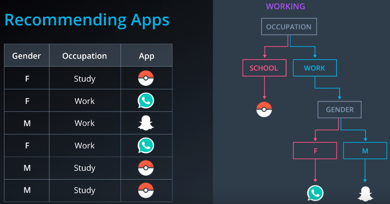
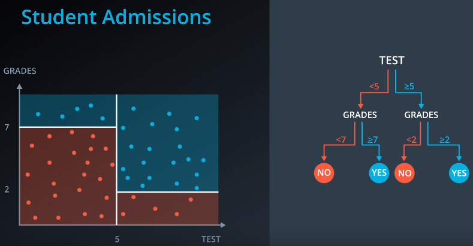
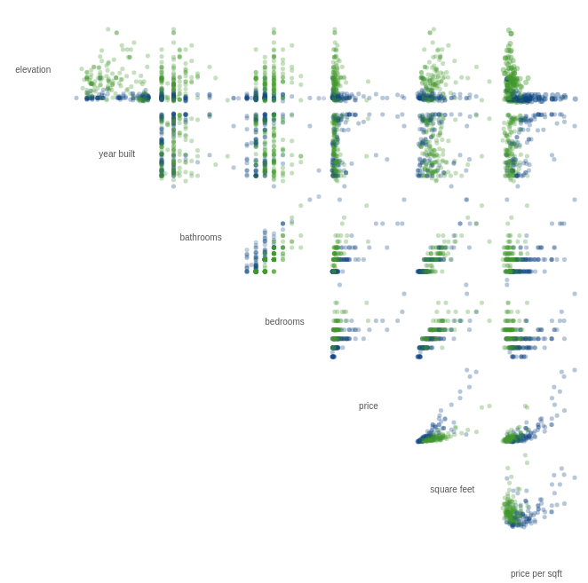
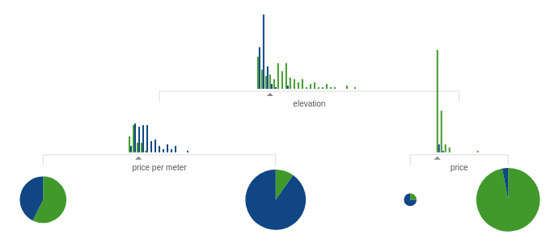
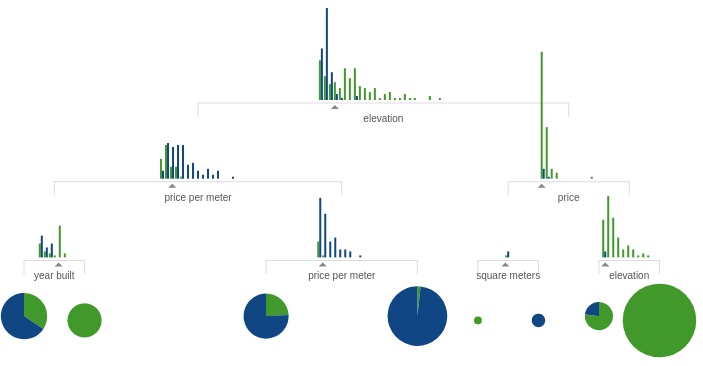
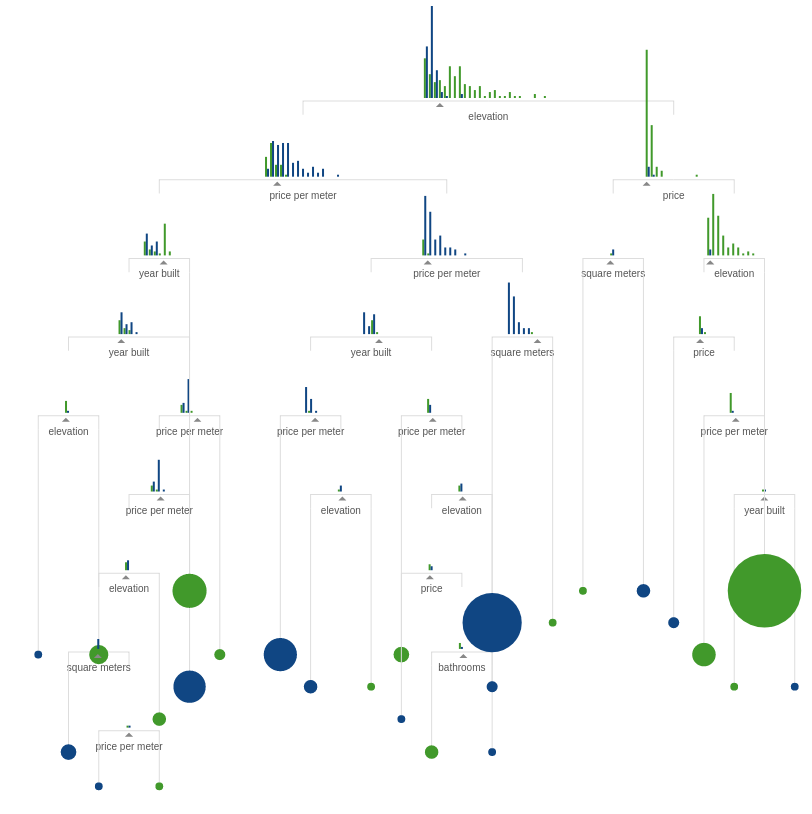
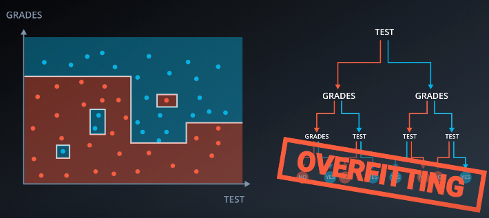
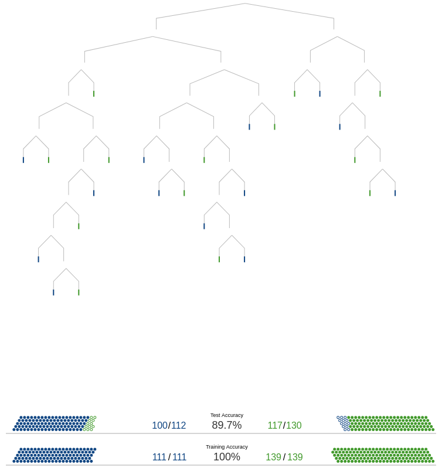
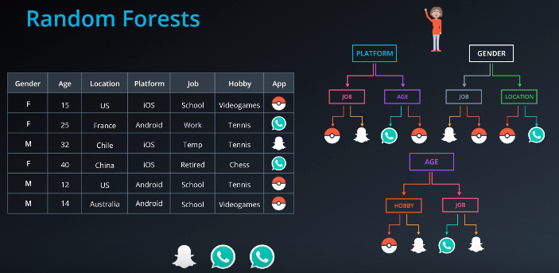

# [Decision Tree](http://scikit-learn.org/stable/modules/tree.html)


```python
%%html
                                  
<script>
code_show = true; 
function code_display() {
    if (code_show) {
        $('div.input').each(function(id) {
            if (id == 0 || $(this).html().indexOf('hide_code') > -1) {$(this).hide();}
        });
        $('div.output_prompt').css('opacity', 0);
    } else {
        $('div.input').each(function(id) {$(this).show();});
        $('div.output_prompt').css('opacity', 1);
    };
    code_show = !code_show;
} 
$(document).ready(code_display);
</script>
                                      
<form action="javascript: code_display()">
<input style="color: #0f0c0c; background: LightGray; opacity: 0.8;" \ 
type="submit" value="Click to display or hide code cells">
</form>
```


                                  
<script>
code_show = true; 
function code_display() {
    if (code_show) {
        $('div.input').each(function(id) {
            if (id == 0 || $(this).html().indexOf('hide_code') > -1) {$(this).hide();}
        });
        $('div.output_prompt').css('opacity', 0);
    } else {
        $('div.input').each(function(id) {$(this).show();});
        $('div.output_prompt').css('opacity', 1);
    };
    code_show = !code_show;
} 
$(document).ready(code_display);
</script>
                                      
<form action="javascript: code_display()">
<input style="color: #0f0c0c; background: LightGray; opacity: 0.8;" \ 
type="submit" value="Click to display or hide code cells">
</form>


Árvores de decisão (DTs) são um método de aprendizagem supervisionada usado para classificação e regressão.

http://www.r2d3.us/uma-introducao-visual-ao-aprendizado-de-maquina-1/

 - **Classificação** (DecisionTreeClassifier)


```python
from sklearn import tree

X = [[0, 0], [1, 1]]
Y = [0, 1]

model = tree.DecisionTreeClassifier()
model = model.fit(X, Y)
```

 - **Regressão** (DecisionTreeRegression)


```python
from sklearn import tree

X = [[0, 0], [1, 1]]
Y = [0, 1]

model = tree.DecisionTreeRegressor()
model = model.fit(X, Y)
```

## Advantages:

 - Simples de entender e interpretar. Árvores podem ser visualizadas.
 - Requer pouca preparação de dados. Outras técnicas geralmente requerem a normalização de dados e variáveis dummy.
 - **O custo de prever dados é logarítmico.**
 - Capaz de lidar com dados numéricos e categóricos. 
 - Capaz de lidar com problemas de várias saídas. (dimensões no eixo x)
 - Possível validar um modelo usando testes estatísticos. Isso torna possível explicar a confiabilidade do modelo.
 
 #### HINT!
Um método para fazer árvores de decisão, que usa uma série de instruções **if-else** para identificar limites e definir padrões nos dados.

## Examples


```python
#hide_code
from IPython.display import Image
Image('/home/brunocampos01/projetos/data_science_machine_learning/images/ex_tree.png')
```





```python
#hide_code
from IPython.display import Image
Image('/home/brunocampos01/projetos/data_science_machine_learning/images/ex_tree_2.png')
```





## Add Features in tree

 - Bifurcações adicionarão novas informações que podem aumentar a precisão da previsão da árvore.
 
 
 
### Example:
 - Prever se os imóveis localizados ficam em São Francisco ou em Nova Iorque.
 - O conjunto de dados que estamos usando para criar o modelo tem 7 dimensões diferentes.
 - Abaixo há o gráfico de dispersão para mostrar as relações entre cada par de dimensões. Existem claramente padrões nos dados, mas os limites para deliná-los não são óbvios.


```python
#hide_code
from IPython.display import Image
Image('/home/brunocampos01/projetos/data_science/images/decision_tree_0.png')
```





 - Como temos várias dimensões, podemos utilizar uma árvore de decisão para analisar essas variáveis dependentes.
 - Na imagem abaixo temos, 82% de precisão


```python
#hide_code
from IPython.display import Image
Image('/home/brunocampos01/projetos/data_science/images/decision_tree_1.png')
```





 * 84% de precisão


```python
#hide_code
from IPython.display import Image
Image('/home/brunocampos01/projetos/data_science/images/decision_tree_2.png')
```





 * 100% de precisão


```python
#hide_code
from IPython.display import Image
Image('/home/brunocampos01/projetos/data_science/images/decision_tree_3.png')
```





## Florestas aleatórias
 Uma árvore de decisão pode não generalizar bem se houver muitos ramos e acabar gerando um overfitting.


```python
#hide_code
from IPython.display import Image
Image('/home/brunocampos01/projetos/data_science_machine_learning/images/overfitting_tree.png')
```





Com os dados de treino, o modelo de decision tree se saiu perfeito (precisão = 100%) mas com dados novos acabou fazendo um overfitting


```python
#hide_code
from IPython.display import Image
Image('/home/brunocampos01/projetos/data_science/images/decision_tree_overfit.png')
```





Para evitar o **erro de overfitting**, criamos uma floresta de decisão.
Pegamos colunas aleatórias e fazemos fazemos algumas árvores de decisão.


```python
#hide_code
from IPython.display import Image
Image('/home/brunocampos01/projetos/data_science_machine_learning/images/ramdom_florests.png')
```





## Hiperparâmetros para árvores de decisão

### Profundidade máxima (max_depth)
Uma profundidade grande muito frequentemente causa um **sobreajuste**, já que uma árvore que é muito profunda pode memorizar os dados. 


```python
#hide_code
from IPython.display import Image
Image('/home/brunocampos01/projetos/data_science_machine_learning/images/deep_tree.png')
```


### Número mínimo de amostras por folha (min_samples_split)
Amostras mínimas pequenas por folha podem resultar em folhas com muito poucas amostras, o que faz o que o modelo memorize os dados (**sobreajuste**).


```python
#hide_code
from IPython.display import Image
Image('/home/brunocampos01/projetos/data_science_machine_learning/images/leaf_tree.png')
```


```python
#hide_code
from IPython.display import Image
Image('/home/brunocampos01/projetos/data_science_machine_learning/images/ramdom_florests.png')
```

## disadvantages:
 - **overfitting**: gera árvores super complexas que não generalizam bem os dados.
 - NP-completo
 - São modelos instáveis (alta variância), pequena variações nos dados de treino podem resultar em árvores completamente distintas.
 - os algoritmos de árvore de decisão são baseados em algoritmos heurísticos, como o algoritmo guloso, em que decisões locais ótimas são tomadas em cada nó. Tais algoritmos não podem garantir o retorno da árvore de decisão ótima globalmente. Isso pode ser atenuado pelo treinamento de várias árvores em um aprendiz conjunto, onde os recursos e amostras são amostrados aleatoriamente com a substituição.

 - Teoria da entropia
 - Calculo de entropia com probabilidade

#### Transformar um produto em uma soma
Uso log
Pois há a propriedade:
    log(ab) = log(a) + log(b)
