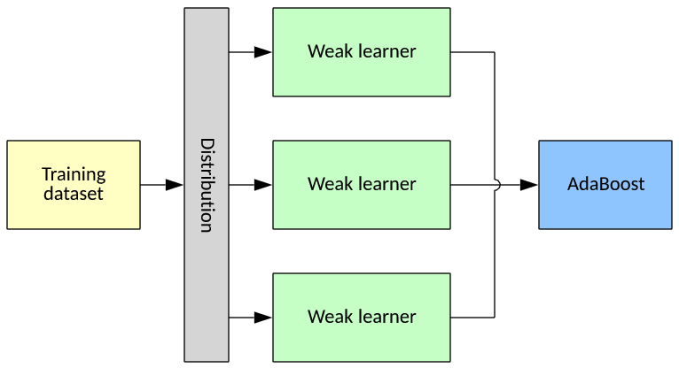

# Ensemble Methods

O objetivo dos ensemble methods é combinar as previsões de vários estimadores de base construídos com um dado algoritmo de aprendizado, a fim de melhorar a generalização de um único estimador.

Duas famílias de ensemble methods:

** Bagging**: o princípio de condução é construir vários estimadores de forma independente e depois calcular a média de suas previsões. Em média, o estimador combinado é geralmente melhor que qualquer um dos estimadores de base única porque sua variância é reduzida.

Exemplos:Decision tree

**Boosting**: os estimadores de base são construídos sequencialmente e um deles tenta reduzir o viés do estimador combinado. A motivação é combinar vários modelos fracos para produzir um conjunto poderoso.

Exemplos: AdaBoost , Melhoria de Árvore de Gradiente ,…


## Method Bagging

### Example:
Vamos fazer um teste com a ajuda de várias pessoas


Cada pessoa responde o questionário e as respostas que obtiverem mais votação são escolhidas

# Method Boosting
O boosting é bem parecido com o bagging mas neste caso ele explora os pontos fortes de cada pessoas (weak leaner).<br/>
Sabemos que cada pessoa tem uma área de conhecimento, sendo assim fundimos todos eu um **strong learner**.


Cada pessoa (método) isolado é um weak learner mas a junção cria um **strong learner**.


Esta fusão de modelos é chamada de **method boosting**.

# Bagging

Conjunto de dados:


Conjunto de weak learners:


**OBS**: Geralmente não treinamos muitos modelos nos mesmos dados pois é muito trabalhoso. Por isso vamos treinar cada weak learner em um subconjunto de dados aleatórios.

---
Agora fazemos a sobreposição de cada learners encima do conjuto de dados.


Como resultado obtemos um modelo ideal para este conjunto de dados.

# AdaBoost (adaptive Boosting)




### Example 1)
Nos 3 exemplos abaixo, temos um _weight_ para cada método.


### Example 2)


Agora, calculamos os pesos das junções dos métodos.


Pronto!<br/>
Agora temos um modelo adaboot completo.

### Hyperparameters

Quando definimos o modelo, podemos especificar os hiperparâmetros. Na prática, os mais comuns são

`base_estimator`: O modelo utilizado para os weak learners (Aviso: Não esqueça de importar este modelo).<br/>
`n_estimators`: O número máximo de weak learners utilizados.

Por exemplo, aqui, nós definimos um modelo que usa árvores de decisão de max_depth 2 como os weak learners e permite um máximo de 4 deles.


```python
from sklearn.ensemble import AdaBoostClassifier
from sklearn.tree import DecisionTreeClassifier

model = AdaBoostClassifier(base_estimator = DecisionTreeClassifier(max_depth=2), n_estimators = 4)
```

Agora temos um strong learner !

## References:

- http://scikit-learn.org/stable/modules/ensemble.html
- https://people.cs.pitt.edu/~milos/courses/cs2750/Readings/boosting.pdf
- https://www.csie.ntu.edu.tw/~mhyang/course/u0030/papers/schapire.pdf
