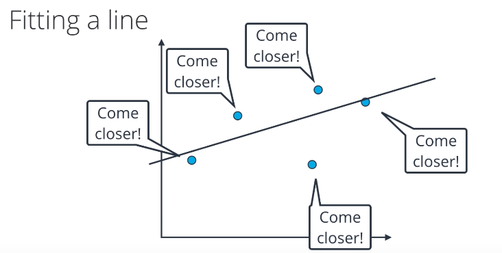
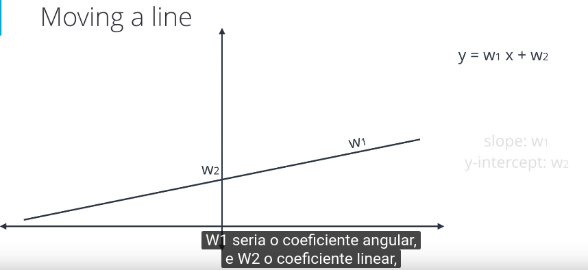
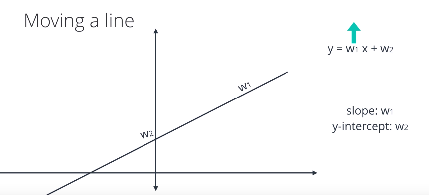
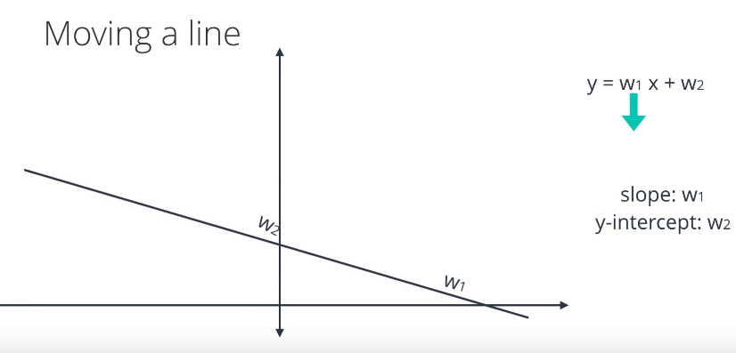
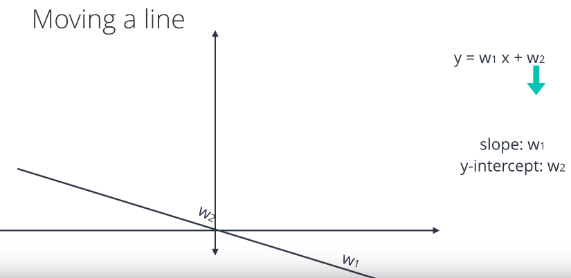
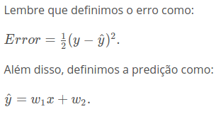
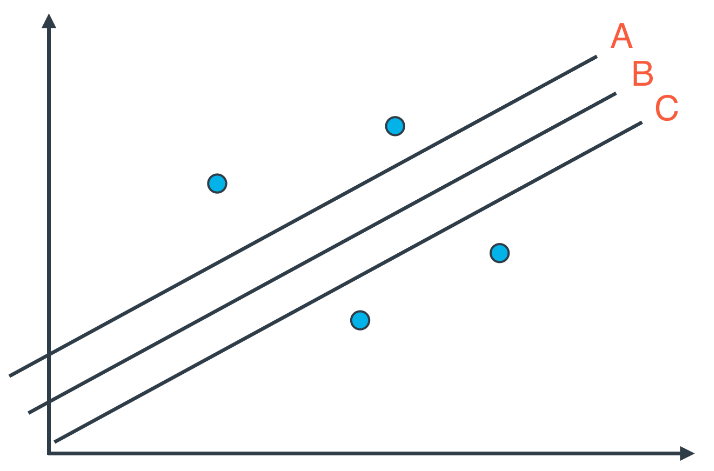
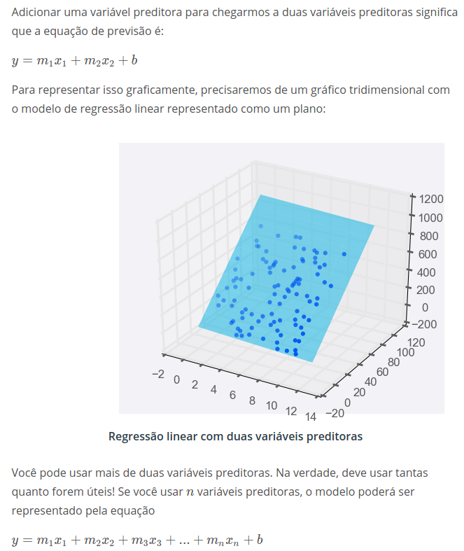

# **Linear Regression**

A tarefa da análise da regressão é determinar qual modelo linear específico representa o melhor ajuste para estes dados. 
Basicamente a ideia de uma regressao linear é dar pequenos espaços entre os pontos para que a reta se aproxime de todos os pontos.

## Advantages
- Otima solução quando a relação entre as variáveis dependentes(y) e independentes(x) geram uma linha. 
- Encontrar correlação entre variáveis
- Fáçil de encontrar outliers

## Errors
 - É a diferença entre o valor real e o valor predito.
 - Resíduo = erro médio absoluto

#### É possivel calcular um erro médio quadrático.

 - OBS: a única difrença para o que eu vi em técnicas estatíticas de predição foi a derivação da fórmula.

## Comparison on types of errors

#### Erro médio absoluto:
 - indiferente da reta, sempre dará o mesmo tamanho de erro.

#### Erro médio quadrático
 - Neste caso temos uma função de 2º grau, onde a linha B se encontra no ponto mais baixo.

## Regressão Linear Multipla

A regressão linear simples é útil para prever o valor de uma variável dependente por uma variável independente. Contudo, este tipo de regressão não é muito útil no contexto real pois sempre há mais de um fator que pode influenciar uma variável dependente (y).

Por exemplo, no caso abaixo temos o preço das casas (y = variável dependente) que é afetado pela qualidade de ensino das escolas proximas (x1) e pelo tamanho da casa(x2). 

A partir disso, observamos que o preço de uma casa (y) pode ser afetado (ser dependente) por N variáveis(x).

## Disadvantages

A regressão linear nem sempre é a melhor escolha dependendo da situação. Exemplos:
 - **Regressão linear funciona melhor quando os dados são lineares:** 
A regressão linear produz um modelo que é uma linha reta extraída a partir dos dados de treinamento

 - **Regressões lineares são sensíveis a casos extraordinários:** 
A regressão linear tenta encontrar a linha que "melhor se encaixa" nos dados de treinamento. Caso o conjunto de dados tenha valores extremos que fujam muito do padrão geral, eles podem ter um efeito inesperadamente grande no modelo.

## References:

Material da disciplina:
https://moodle.ufsc.br/pluginfile.php/1592338/mod_resource/content/1/An%C3%A1lise%20da%20regres%C3%A3o.pdf
