# **Linear Regression**

A tarefa da análise da regressão é determinar qual modelo linear específico representa o melhor ajuste para estes dados.<br/>
Basicamente a ideia de uma regressao linear é dar pequenos espaços entre os pontos para que a reta se aproxime de todos os pontos.


```python
%%html
                                  
<script>
code_show = true; 
function code_display() {
    if (code_show) {
        $('div.input').each(function(id) {
            if (id == 0 || $(this).html().indexOf('hide_code') > -1) {$(this).hide();}
        });
        $('div.output_prompt').css('opacity', 0);
    } else {
        $('div.input').each(function(id) {$(this).show();});
        $('div.output_prompt').css('opacity', 1);
    };
    code_show = !code_show;
} 
$(document).ready(code_display);
</script>
                                      
<form action="javascript: code_display()">
<input style="color: #0f0c0c; background: LightGray; opacity: 0.8;" \ 
type="submit" value="Click to display or hide code cells">
</form>
```


                                  
<script>
code_show = true; 
function code_display() {
    if (code_show) {
        $('div.input').each(function(id) {
            if (id == 0 || $(this).html().indexOf('hide_code') > -1) {$(this).hide();}
        });
        $('div.output_prompt').css('opacity', 0);
    } else {
        $('div.input').each(function(id) {$(this).show();});
        $('div.output_prompt').css('opacity', 1);
    };
    code_show = !code_show;
} 
$(document).ready(code_display);
</script>
                                      
<form action="javascript: code_display()">
<input style="color: #0f0c0c; background: LightGray; opacity: 0.8;" \ 
type="submit" value="Click to display or hide code cells">
</form>


## Advantages
- Otima solução quando a relação entre as variáveis dependentes(y) e independentes(x) geram uma linha. 
- Encontrar correlação entre variáveis
- Fáçil de encontrar outliers


```python
hide_code
from IPython.display import Image
Image('/home/brunocampos01/projetos/data_science/images/fitting_line.png')
```


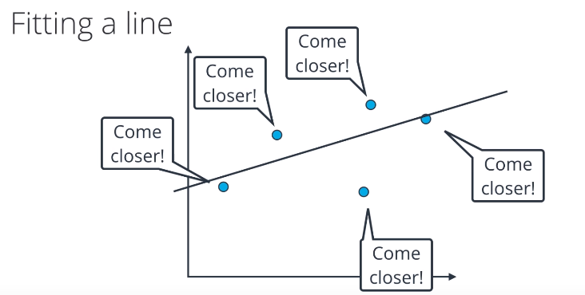


```python
hide_code
from IPython.display import Image
Image('/home/brunocampos01/projetos/data_science_machine_learning/tutorial/imagens/moving_line.png')
```


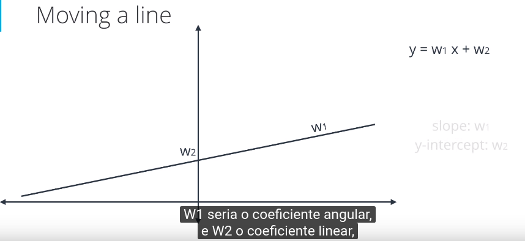


```python
hide_code
from IPython.display import Image
Image('/home/brunocampos01/projetos/data_science_machine_learning/tutorial/imagens/up_w1.png')
```


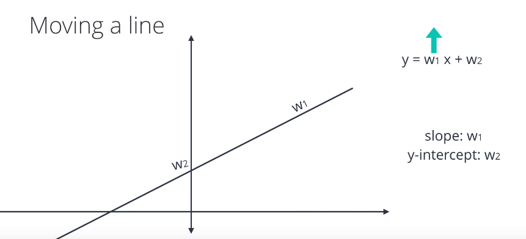


```python
hide_code
from IPython.display import Image
Image('/home/brunocampos01/projetos/data_science_machine_learning/tutorial/imagens/down_w1.png')
```


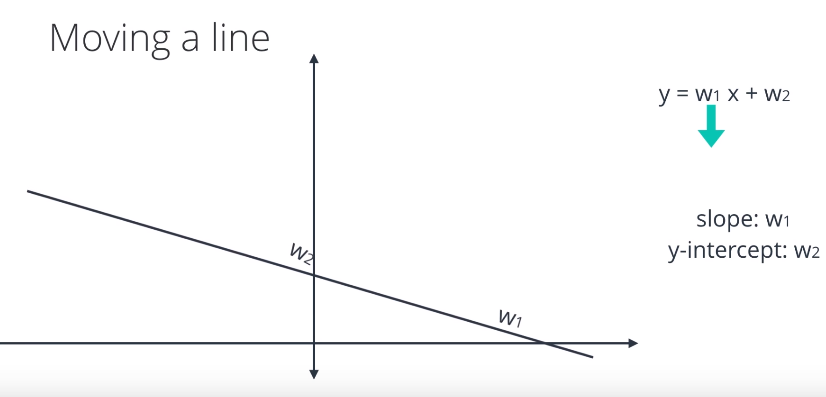


```python
hide_code
from IPython.display import Image
Image('/home/brunocampos01/projetos/data_science_machine_learning/tutorial/imagens/moving_w2.png')
```


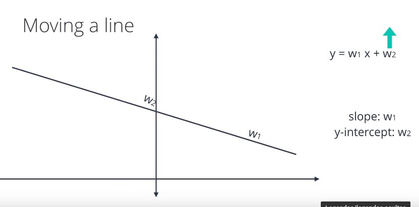


```python
hide_code
from IPython.display import Image
Image('/home/brunocampos01/projetos/data_science_machine_learning/tutorial/imagens/down_w2.png')
```


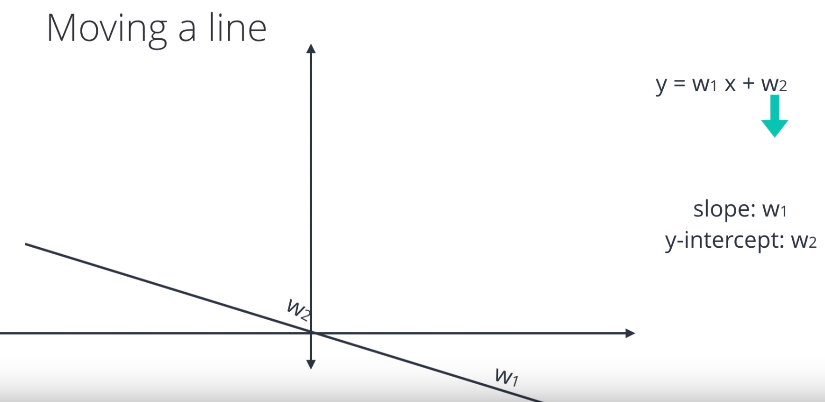


## Erros
 - É a diferença entre o valor real e o valor predito.
 - Resíduo = erro médio absoluto


```python
hide_code
from IPython.display import Image
Image('/home/brunocampos01/projetos/data_science_machine_learning/tutorial/imagens/residuos.png')
```


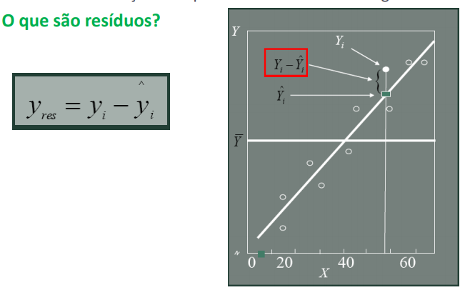


```python
hide_code
from IPython.display import Image
Image('/home/brunocampos01/projetos/data_science_machine_learning/tutorial/imagens/formulas.png')
```


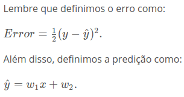


### É possivel calcular um erro médio quadrático.


```python
hide_code
from IPython.display import Image
Image('/home/brunocampos01/projetos/data_science_machine_learning/tutorial/imagens/erro_quadrado_medio.png')
```


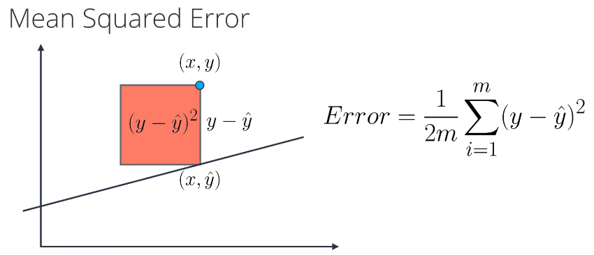


 - OBS: a única difrença para o que eu vi em técnicas estatíticas de predição foi a derivação da fórmula.
 
Material da disciplina:
https://moodle.ufsc.br/pluginfile.php/1592338/mod_resource/content/1/An%C3%A1lise%20da%20regres%C3%A3o.pdf

## Comparação sobre tipos de erros


```python
hide_code
from IPython.display import Image
Image('/home/brunocampos01/projetos/data_science_machine_learning/tutorial/imagens/exercicio_tipos_erros.png')
```


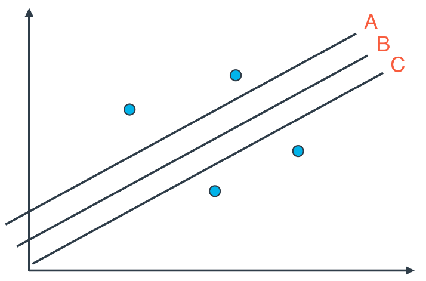


#### Erro médio absoluto:
 - indiferente da reta, sempre dará o mesmo tamanho de erro.

#### Erro médio quadrático
 - Neste caso temos uma função de 2º grau, onde a linha B se encontra no ponto mais baixo.


```python
hide_code
from IPython.display import Image
Image('/home/brunocampos01/projetos/data_science_machine_learning/tutorial/imagens/resposta_erro.png')
```


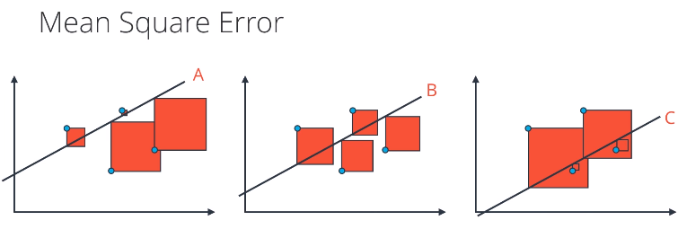


## Regressão Linear Multipla

A regressão linear simples é útil para prever o valor de uma variável dependente por uma variável independente. Contudo, este tipo de regressão não é muito útil no contexto real pois sempre há mais de um fator que pode influenciar uma variável dependente (y).

Por exemplo, no caso abaixo temos o preço das casas (y = variável dependente) que é afetado pela qualidade de ensino das escolas proximas (x1) e pelo tamanho da casa(x2). 


```python
hide_code
from IPython.display import Image
Image('/home/brunocampos01/projetos/data_science_machine_learning/tutorial/imagens/regressao_linear_multipla.png')
```


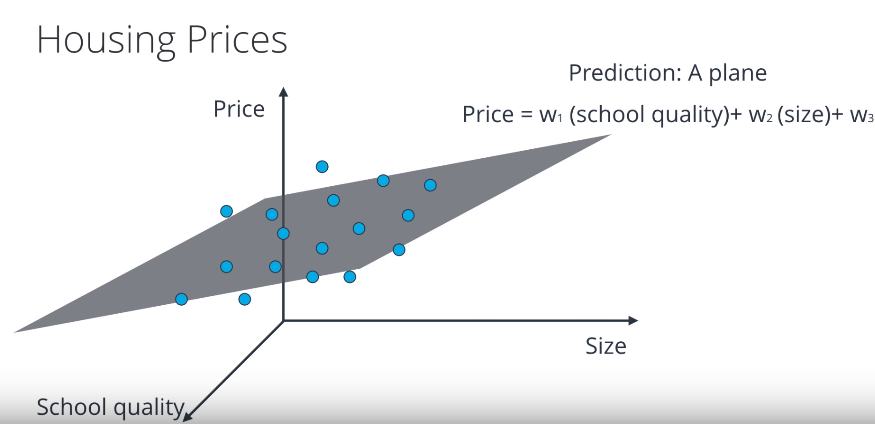


A partir disso, observamos que o preço de uma casa (y) pode ser afetado (ser dependente) por N variáveis(x).


```python
hide_code
from IPython.display import Image
Image('/home/brunocampos01/projetos/data_science_machine_learning/tutorial/imagens/regressao_linear_multipla_x.png')
```


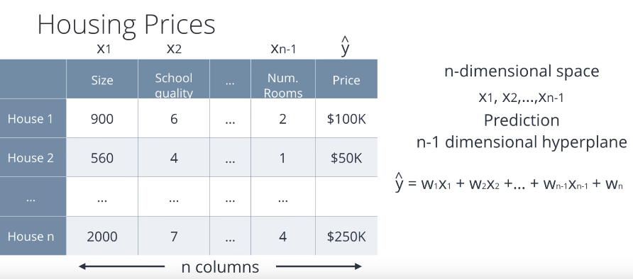


```python
hide_code
from IPython.display import Image
Image('/home/brunocampos01/projetos/data_science_machine_learning/tutorial/imagens/uma_variavel_preditora.png')
```


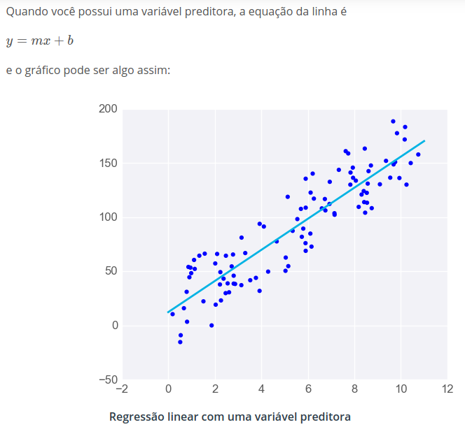


```python
hide_code
from IPython.display import Image
Image('/home/brunocampos01/projetos/data_science_machine_learning/tutorial/imagens/duas_variavel_preditora.png')
```


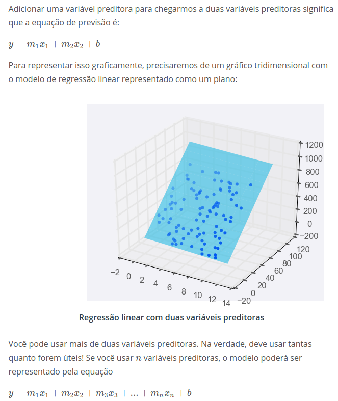


## Disadvantages

A regressão linear nem sempre é a melhor escolha dependendo da situação. Exemplos:
 - **Regressão linear funciona melhor quando os dados são lineares:** 
A regressão linear produz um modelo que é uma linha reta extraída a partir dos dados de treinamento


```python
hide_code
from IPython.display import Image
Image('/home/brunocampos01/projetos/data_science/images/quadraticlinearregression.png')
```


 - **Regressões lineares são sensíveis a casos extraordinários:** 
A regressão linear tenta encontrar a linha que "melhor se encaixa" nos dados de treinamento. Caso o conjunto de dados tenha valores extremos que fujam muito do padrão geral, eles podem ter um efeito inesperadamente grande no modelo.


```python
hide_code
from IPython.display import Image
Image('/home/brunocampos01/projetos/data_science_machine_learning/tutorial/imagens/lin-reg-w-outliers.png')
```


