# Perceptron Algorithm

É um algoritmo para aprendizado supervisionado que calcula uma equação linear.
 
 ## What is a perceptron?
 Um perceptron é um algoritmo que tem uma ou mais entradas, um viés, uma função de ativação e uma única saída.
 
 ## How it works?
 O perceptron recebe entradas, multiplica-as por algum peso e, em seguida, as passa para uma função step para produzir uma saída. Existem muitas funções de step possíveis para escolher, como a função logística, uma função trigonométrica,etc.

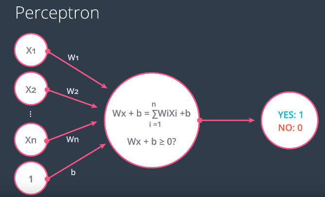

Onde:
 - **x** são as entradas
 - **w** são os pesos 
 - **b** é a unidade de viés (bias)

## Example)

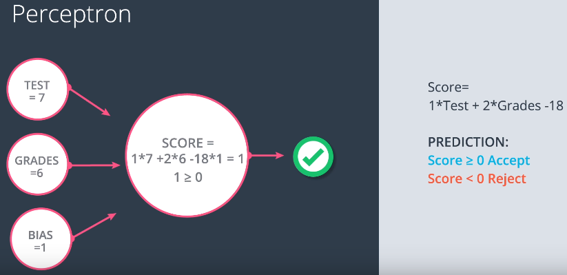

## Step Function
Um algoritmo perceptron é a combinação de nós, sendo o primeiro calculando uma equação linear e o segundo  uma equação de validação.

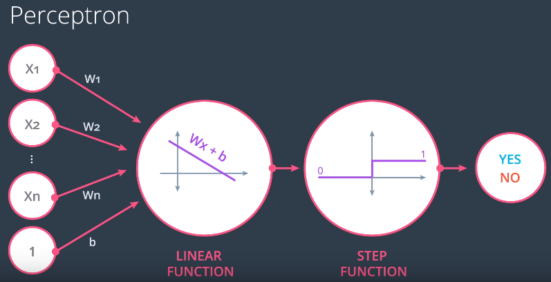


```python
def stepFunction(t):
    if t >= 0:
        return 1
    return 0
```

# Perceptrons with logical operators


## AND

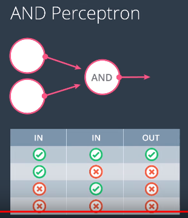


## OR


O perceptron OR é muito semelhante a um perceptron AND. Na imagem abaixo, o perceptron OR contém a mesma linha que o perceptron AND, com a diferença de que ela está mais para baixo. 


## Conversion from AND to OR
Para transformar um perceptron E em um perceptron OU é possível de duas formas:
 - Diminuindo a magnetude do viés (b)
 - Aumentando os pesos (w)
                                                       

## Test: Build a multilayer XOR
A rede neural abaixo contém 3 perceptrons: A, B e C


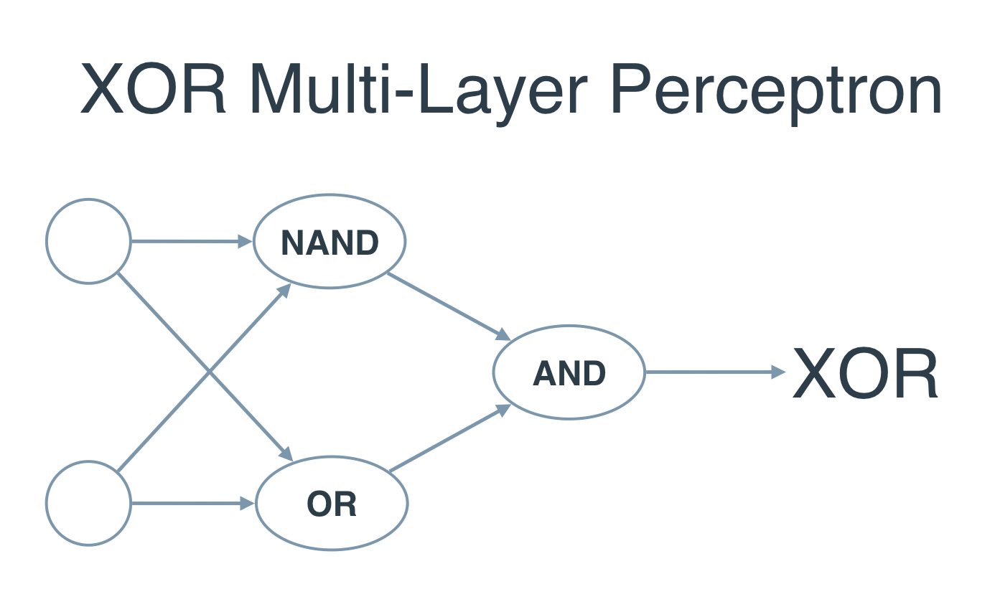

## Limitations of perceptron networks
 - os valores de saída do perceptron podem assumir somente dois valores (Verdadeiro ou Falso).
 - perceptrons somente podem classificar grupos de vetores linearmente separados.

## Calculation of the equation of the line

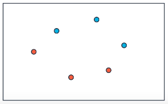

Dado este conjunto de dados, podemos começar inserindo uma reta de modo aleatório.

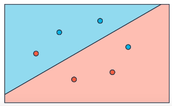

Por ser um algoritmo classificador, a reta irá classificar duas regiões. Contudo é possível notar que nem todos os pontos foram classificados corretamente.

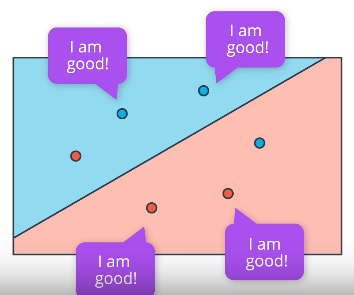

## How to improve the quality of the classification of the line?

Neste exemplo abaixo, temos a equação da reta e um ponto que esta classificado errado.

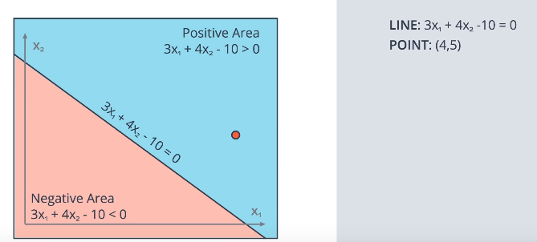

### Correcting the classification

 - 1º passo) Inserir um B (bias) ao ponto. Neste caso será 1 
   (4,5,1)
 - 2º passo) copiar os valores W da equação da reta.

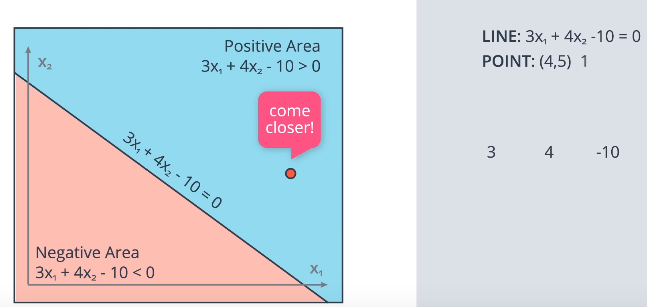

 - 3º passo) Subtrair os valores W da equação da reta com os valores do ponto.
 Com estes 3 passos já temos uma nova equação da reta que classifica CORRETAMENTE o ponto.

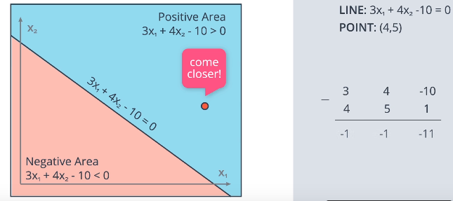

Contudo...

Houve uma mudança drástica na reta, se houvesse mais pontos eles poderiam ser afetados.
Para evitar esse tipo de problema utilizamos uma **LEARNING RATE**.

#### Correcting classification with learning rate

Geralmente começamos com um valor bem pequeno (0.1) e vamos analisando os resultados.
 - 1º passo) Esta constante multiplicará os valores do pontos
 - 2º passo) Subtrair os valores W da equação da reta com os valores do ponto que foram multiplicados pela LEARNING RATE.

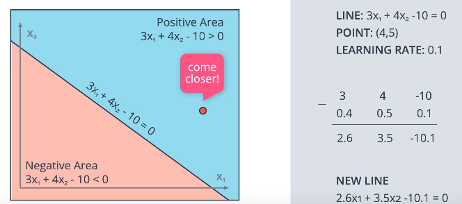

Pronto !

Agora a equação se moveu pouco e podemos controlar suas movimentações através da learning rate.
Outro exemplo)

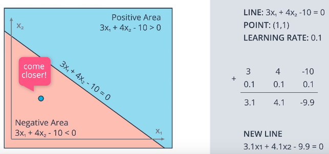

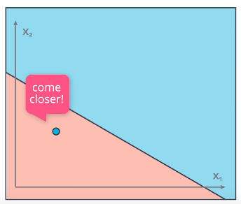

**O algoritmo ficou assim:**
    
Para um ponto com coordenadas (p,q), rótulo y e previsão dada pela equação:
y
^
​	 =step(w 
1
​	 x 
1
​	 +w 
2
​	 x 
2
​	 +b)

 - Se um ponto for classificado corretamente, não faça nada.
 - Se o ponto for classificado **positivamente, mas tiver um rótulo negativo**, subtraia αp,αq, e α de w_1, w_2 e b respectivamente.
 - Se o ponto for classificado **negativamente, mas tiver um rótulo positivo**, some αp,αq, e α a w_1, w_2 e b respectivamente.


```python
# perceptron step
# inputs the data X, the labels y, the weights W (as an array), and the bias b
import numpy as np

def stepFunction(t):
    if t >= 0:
        return 1
    return 0

def prediction(X, W, b):
    return stepFunction((np.matmul(X,W)+b)[0])

def perceptronStep(X, y, W, b, learn_rate = 0.01):
    for index in range(len(X)):
        x1 = X[index][0]
        x2 = X[index][1]
        label = 1.0 if x1 * W[0] + x2 * W[1] + b > 0 else 0.0
        if label > y[index]:
            # subtract αp, αq, and α from w1, w2, and b respectively
            W[0] -= x1 * learn_rate
            W[1] -= x2 * learn_rate
            b -= learn_rate
        elif label < y[index]:
            # add αp, αq, and α from w1,w2, and b respectively
            W[0] += x1 * learn_rate
            W[1] += x2 * learn_rate
            b += learn_rate
    return W, b
```

## References:
- http://scikit-learn.org/stable/modules/generated/sklearn.linear_model.Perceptron.html
- https://en.wikipedia.org/wiki/Perceptron
